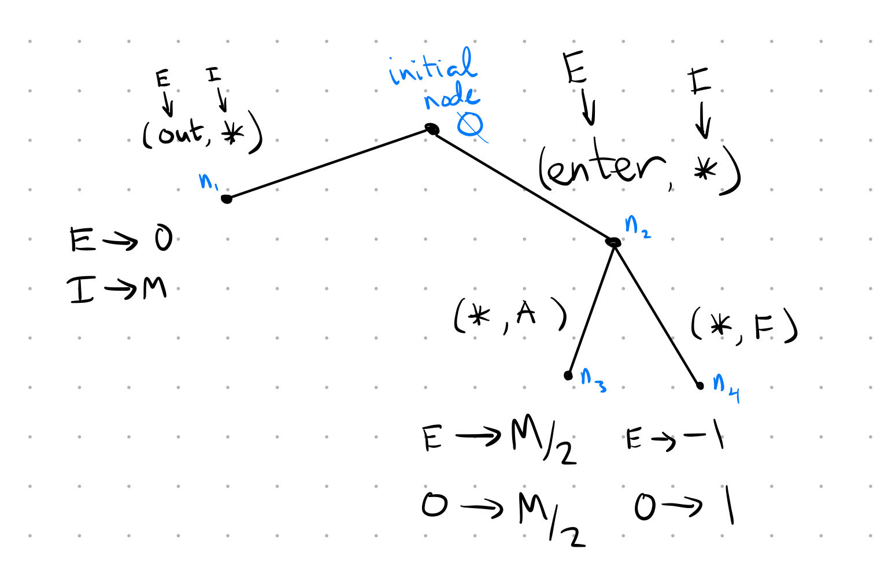

# Simultaneous-move Games of Complete Information

Can model these as strategic-form games

### Def "strategic-form game"

A strategic-form game is a $G = (S_i, u_i = 1, ..., I)$ such that

1. $\{1, ..., I\}$ is a set of players
2. $S_i$ is a set of strategies for player $i$
3. $u_i: \Pi_{j=1}^I S_j \rightarrow \mathbb{R}$ is a payoff function for player $i$. ($u_i$ maps from strategy profiles to real (integrable) numbers.)
    
    
**Example 1:** introduce NE    
    
### Def "Nash Equilibrium (PSNE)"
Call $(s_1^*, ... ,s_I^*)$ a Nash equilibrium if, for each $i = 1, ..., I$
$$u_i(s_i^*, s_{-i}^*) \geq u_i(s_i, s_{-i}), \forall s_i \in S_i.$$

> "deviating to some $s_i$ is not going to make me any better off.

### Def "Best Response"
Say $s_i \in S_i$ is a best response for $i$ under $s_{-i}$ if
$$u_i(s_i, s_{-i}) \geq u_i(s_i', s_{-i})~~~~ \forall s_i' \in S_i.$$

### Def "Best Response Correspondence"
$BR_i: S_{-i} \rightrightarrows S_i$ such that
$$BR_i(s_{-i}) = \{s_i \in S_i: s_i \text{ is a best response for } i \text{ under } s_{-i}\}$$

#### Remark 1 "NE $\iff s_i^* \in BR_i(s_{-i})$"
A strategy profile is a Nash Equilibrium if and only if, for each $i = 1, ..., I$
$$s_i^* \in BR_i(s_{-i}).$$
**Example 2** Maximize revenue to find BR correspondence. Determine PSNE from correspondence.

**Example 3** "Increasing payoffs can hurt"

> Difference between Game Theory and Decision Theory: In DT, increasing payoffs cannot hurt. In GT, there are scenarios under which increasing payoffs can hurt. 

**Example 4** "incentive to hide what you are playing"

> Randomization is a way of hiding what's being played.

### Def "set of mixed strategies of $i$"
The set of probability measures or distributions on $S_i$ is $\Delta(S_i).$

Given $E_i \subseteq S_i$ (event), $\sigma(E_i)$ is the probability that $i$ plays a strategy in $E_i$, if $i$ chooses the mixed strategy $\sigma_i$.

#### Remark 2 "infinite strategies have no atoms"
If $S_i$ is finite, then $\sigma_i(E_i) = \sum_{s_i \in E_i} \sigma_i(s_i)$. But, this property need not hold when $S_i$ is infinite.

#### Remark 3
We have (above) defined a new game called the "mixed extension" of $G = (S_i, u_i: i = 1, ..., I)$. The differences are (1) strategy sets are now $\Delta(S_i)$, and (2) the payoff of $i$ from $(\sigma_1, ..., \sigma_I)$ is $u_i(\sigma_1, ..., \sigma_I)$.

#### Remark 4
Consider a finite game (a game in which $S_i$ is finite for each $i = 1, ..., I$.). The payoff is 
$$u_i(\sigma_1, ..., \sigma_I) = \Sigma_{S_I}\cdot \cdot \cdot \Sigma_{S_1}u_i(s_1, ..., s_I)\sigma_1(s_1) \cdot \cdot \cdot \sigma_I(s_I).$$

### Def "Mixed Strategy Nash Equilibrium (MSNE)"
Call $(\sigma_1, ..., \sigma_I)$ a "Mixed Strategy Nash Equilibrium" (MSNE) if, and only if, for each $i=1, ..., I$

$$u_i(\sigma_i^*, \sigma_{-i}^*) \geq u_i(\sigma_i, \sigma_{-i}^*), \forall \sigma_i \in \Delta(S_i).$$

### Lemma 1 "MSNE $\iff$ weakly better than all pure strategies" 
A strategy profile $(\sigma_1, ..., \sigma_I)$ is a MSNE if, and only if, for each $i$

$$u_i(\sigma_i^*, \sigma_{-i}^*) \geq u_i(s_i, \sigma_{-i}^*), \forall s_i \in S_i.$$

### Lemma 2 "MSNE $\iff$ strategy in support is best"
Fix a finite game $G = (S_i, u_i: i = 1, ..., I)$.

Then $(\sigma_1, ..., \sigma_I)$ is a MSNE if, and only if, for each $i$ and for each $s_i \in S_i$, with $\sigma_i^*(s_i) > 0,$

$$u_i(s_i, \sigma_{-i}^*) \geq u_i(r_i, \sigma_{-i}^*), \forall r_i \in S_i.$$

#### Remark 5 "Lemma 2 doesn't have the right context for the infinite case"

### Cor 1 "indifference condition"
Fix a finite game $G = (S_i, u_i: i = 1, ..., I)$. 

If $(\sigma_1, ..., \sigma_I)$ is a MSNE and with $\sigma_i^*(s_i), \sigma_i^*(r_i) > 0,$ then

$$u_i(s_i, \sigma_{-i}^*) = u_i(r_i, \sigma_{-i}^*).$$

**Example 5** "Lemma 2 doesn't work in the infinite case + intuition for how to extend"

### Thm "from online notes"
1. If $\sigma_i$ induces $F_i$, then $F_i$ is a CDF
2. If $F_i$ is a CDF, then there exists a *unique* $\sigma_i$ that induces $F_i$.

#### Remark 6 "unanswered questions"
We constructed an example of a symmetric MSNE. But, we have not shown it is the only such symmetric MSNE. Can we have a symmetric MSNE with gaps in the support? Can we have a symmetric MSNE with atoms?

#### Remark 7 "pdf/cdf technical notes"
omitted

## Existence of Pure and Mixed Strategy Nash Equilibria

#### Notation: "Mixed Best Response Correspondence"

We've already seen one correspondence: $BR_i: S_{-i} \rightrightarrows S_i$ such that 
$$BR_i(s_{-i}) = \{s_i \in S_i: s_i \text{ is a best response to } s_{-i}\}.$$

Now, we have $\tilde{BR}_i: \Pi_{j \neq i} \Delta (S_j) \rightrightarrows \Delta(S_i)$ such that 
$$\tilde{BR}_i(\sigma_{-i}) = \{\sigma_i \in \Delta(S_i): \sigma_i \text{ is a best response under } \sigma_{-i}\}.$$

For all players:

$$\tilde{BR}: \Pi_{i=1}^I \Delta(S_i) \rightrightarrows \Pi_{i=1}^I \Delta(S_i) \text{ such that } \tilde{BR}_i(\sigma_1, ..., \sigma_I) = \Pi_{i=1}^I \tilde{BR} (\sigma_1, ..., \sigma_{i-1}, \sigma_{i+1}, ..., \sigma_I).$$

### Result "NE $\iff$ fixed point of BR"

* $(s_1^*, ..., s_I^*)$ is a PSNE $\iff (s_1^*, ..., s_I^*) \in BR(s_1^*, ..., s_I^*) \iff$ fixed point of $BR$.
* $(\sigma_1^*, ..., \sigma_I^*)$ is a MSNE $\iff (s_1^*, ..., s_I^*) \in \tilde{BR}(\sigma_1^*, ..., \sigma_I^*) \iff$ fixed point of $\tilde{BR}$.

### Thm "Kakutani's fixed point thm"
Let $X$ be nonempty compact convex set. If $F$ is nonempty, convex-valued, and has a closed graph, then $F$ has a fixed point.

### Thm 1 "conditions to guarantee existence of PSNE"
Fix a game where, for each $i = 1, ..., I$, if 

1. there exists an $n_i$ such that $S_i$ is a nonempty, compact, convex subset of $\mathbb{R}^{n_i}$,
2. $u_i: S \rightarrow \mathbb{R}$ is continuous, and 
3. for each $s_{-i}$, holding $s_i$ fixed, $u_i(\cdot, s_{-i}): S_i \rightarrow \mathbb{R}$ is quasiconcave.

> nonempty: from $S_i$ being compact and continuity of utility fn (BR has to be nonempty)

> closed-graph: from continuity of $u_i$

> convex-valued ($F$): from quasiconcavity of $u_i(\cdot, s_{-i}): S_i \rightarrow \mathbb{R}$

### Thm 2 "conditions to guarantee existence of MSNE"
For each finite game, there exists a MSNE.

### Thm 3 "Glicksberg's thm"
Fix a game, $G$ where, for each $i$,

1. $S_i$ is compact metric space, and 
2. $u_i: S \rightarrow \mathbb{R}$ is continuous.

Then $G$ has a MSNE.

#### Remark 8
Glicksberg's thm doesn't tell us that the assumptions of compactness and continuity are interesting. E.g., first-price auctions are discontinuous.

#### Remark 9
Glicksberg's thm only tells us there is some equilibrium--there may be many.

#### Remark 10
Existence results are most useful if there are qualitative results of how equlibria vary with interesting parameters of the model/game.

# Rationalizability and Iterated Dominance

**Example 1** "motivation for beliefs: can have wrong beliefs now."

#### Term "belief"
Belief of player $i$: $\mu_i \in \Delta(S_{-i})$

### Def "best response with beliefs"
Fix a nonempty set $Q_i \subseteq S_i$. Say *$s_i$ is a best response under $\mu_i$ given $Q_i$* if $s_i \in Q_i$ and 
$$\int_{S_{-i}} u_i(s_i, s_{-i})d\mu_i \geq \int_{S_{-i}} u_i(r_i, s_{-i})d\mu_i, ~\forall r_i \in Q_i.$$
Say *$s_i$ is a best response under $\mu_i$* if it is a best response under $\mu_i$ given $S_i$.

Or, in discrete settings:
$$\sum_{s_{-i} \in S_{-i}} u_i(s_i, s_{-i})\mu_i(s_{-i}) \geq \sum_{s_{-i} \in S_{-i}} u_i(r_i, s_{-i})\mu_i(s_{-i}), ~\forall r_i \in Q_i.$$

### Def "justifiable"
Fix a nonempty (candidate subset) $Q_{-i} \subseteq S_{-i}$. Say *$s_i$ is justifiable given $Q_{-i}$* if there exists $\mu_i \in \Delta(S_{-i})$ such that

1. $s_i$ is a best response under $\mu_i$ and 
2. $\mu_i(Q_{-i})=1$.

Say $s_i$ is *justifiable* if it is justifiable given $S_{-i}$.

### Def "rationalizable sets"
Let $R_i^0 = S_i; R_{-i}^0 = S_{-i}.$

Inductively define sets $R_i^m$ and $R_{-i}^m$ such that

* $R_i^{m+1} = \{s_i \in S_i: s_i \text{ is justifiable given } R_{-i}^m\}$, and
* $R_{-i}^{m+1} = \Pi_{j \neq i}R_{j}^{m+1}$.

Additional notation:

* $R_i^\infty = \cap_{m\geq 0}$ is the set of rationalizable strategies for $i$.
* $R^\infty = \Pi_{i=1}^I R_i^\infty$ is the set of rationalizable strategy profiles.
* $R^m = \Pi_{i=1}^I R_i^m$ is the set of $m-$rationalizable strategy profiles.

**Examples 2-4** "which strategies are justifiable?"

### Def "(un)dominated"
Fix $Q_1, ..., Q_I$ where each $Q_j \subseteq S_j$.

Say *$s_i$ is dominated given $\Pi_{j=1}^I Q_j$* if $s_i \in Q_i$ and there exists a $\sigma_i \in \Delta(S_i)$ such that
$$u_i(\sigma_i,s_{-i}) > u_i(s_i,s_{-i}),~\forall s_{-i} \in \Pi_{j \neq i}^I Q_j.$$

Say *$s_i$ is undominated given $\Pi_{j=1}^I Q_j$* if it is not dominated given $\Pi_{j=1}^I Q_j$.

Say *$s_i$ is (un)dominated* if it is (un)dominated given $S$.

> Dominance is established given $i$'s OWN strategies: $\Pi_{j=1}^I Q_j$; Rationalizability is established given $-i$'s strategies: $Q_{-i}$

### Def "undominated sets"
Let $U_i^0 = S_i.$ 

Inductively define $U_i^m$ such that
$$U_i^{m+1} = \{s_i \in S_i: s_i \text{ is undominated given } U_{-i}^m\}.$$

Additional notation:

* $U_i^\infty = \cap_{m\geq 0}U_i^m$ is the set of undominated strategies for $i$.
* $U^m = \Pi_{i=1}^I R_i^m$ is the set of $m-$undominated strategy profiles.
* $U^\infty = \Pi_{i=1}^I U_i^\infty$ is the set of *iteratively undominated*  (IU) strategy profiles.

### Thm 1 "$R^m = U^m$"
Fix a finite game. $R^m = U^m, ~\forall m.$

### Prop 1 "justifiable $\iff$ undominated"
Fix a finite game. A strategy $s_i$ is justifiable if, and only if, it is undominated.

### Def "Hyperplane"
A hyperplane in $\mathbb{R}^n$ is a set of the form
$$H[\vec{p}, \alpha] = \{\vec{x} \in \mathbb{R}^n: \vec{p} \cdot \vec{x}= \alpha\}$$
for $\vec{p} \in \mathbb{R}^n \setminus \{0\}$ and $\alpha \in \mathbb{R}$.

### Def "supporting hyperplane"
Fix $A \subseteq \mathbb{R}^n$ and $\vec{x} \in A$. Say $\vec{p} \in \mathbb{R}^n$ (with $\vec{p}\neq \vec{0}$) *supports $A$ at $\vec{x}$* if
$$\vec{p} \cdot \vec{x} \geq \vec{p} \cdot \vec{y}, \forall y \in A.$$

Say $H[\vec{p}, \alpha]$ supports $A$ at $\vec{x}$ if $\vec{p}$ supports $A$ at $\vec{x}$ and $\vec{p} \cdot \vec{x} = \alpha$.

### Thm "Supporting Hyperplane Theorem"
Let $A \subseteq \mathbb{R}^n$, convex and $\vec{x} \in A$. There exists some $\vec{p} \in \mathbb{R}^n$ (with $\vec{p}\neq \vec{0}$) such that $\vec{p}$ supports $A$ at $\vec{x}$ if and only if $\vec{x} \notin int(A)$. (i.e., $\vec{x} \in$ boundary($A$))

**Example 6** "weakly dominated"

### Lemma 1 "later sets subsets of earlier subsets"
For each $i = 1, ..., I$ and each $m\geq 0$, $R_i^{m+1} \subseteq R_i^m$.

### Cor 0.1 "rationalizable set stops shrinking at some point" 
If the game is finite, there exists some number $M$ such that $R^m = R^M$ for all $m \geq M$.

**Example 0.1** NEED TO WORK THROUGH

### Prop 1 "nonempty rationalizable set exists if compact and continuous"
Fix a game $G = (S_i, u_i: i = 1, ..., I)$ where each $S_i$ is a compact metrics space and each $u_i$ is continuous. Then the set of rationalizable strategy profiles is nonempty.

### Def "Weakly Dominated"
Fix non-empty sets $Q_1, ..., Q_I$. Say $s_i$ is *weakly dominated given* $\Pi_{j=1}^I Q_j$ if $s_i \in Q_i$ and there exists $\sigma_i \in \Delta(Q_i)$ so that

1. $u_i(\sigma_i, s_{-i}) \geq u_i(s_i, s_{-i})$ for each $s_{-i} \in \Pi_{j\neq i} Q_j$, and
2. $u_i(\sigma_i, s_{-i}) > u_i(s_i, s_{-i})$ for some $s_{-i} \in \Pi_{j\neq i} Q_j$.

Say $s_i$ is *weakly dominated* if it is weakly dominated given $S$.

### Def "Iterated Weak Dominance"

Set $W_i^0 = S_i$. Inductively define $W_i^m$ such that
$$W_i^{m+1} = \{s_i \in W_i^m: s_i \text{ is not weakly dominated given } \Pi^{I}_{j=1}W_j^m\}.$$

Then $W_i^{m+1}$ is the set of strategies of $i$ that survive $(m+1)$ rounds of iterated weak dominance. 

Set $W_i^\infty = \cap_{m\geq 0}W_i^m$. Then $W^\infty = \Pi_{i=1}^I W_i^\infty$ is the set of strategy profiles that survive iterated weak dominance.

# Sequential Games of Complete Information

**Example 1** Entrant (E) can *enter* or stay *out*. If E enters, then incumbent monopolist (I) can **F**ight or **A**cquiesce. 

Profits to (E, I), subject to $M \geq 2$, are:

* (out, $*$): $(0,M)$
* (enter, A): $(\frac{M}{2},\frac{M}{2})$
* (enter, F): $(-1,1)$

#### Remark 1
Some people will see an example like example 1 and conclude "the strategic form game does not suffice." This is incorrect. We will see (later) that the problem is the solution concept of Nash Equilibrium, not the strategic form, per se.

Visualization vs Formalization - omitted for now.

### Def Extensive Form (model a sequential game as an extensive-form game)

We model a sequential game as an extensive form game: $\Gamma = (A_1, ..., A_J; N; H_1, ..., H_I; U_1, ..., U_I)$.

**Extensive-Form 1:** Players $1, ..., I$

**Extensive-Form 2:** Action Sets $(A_1, ..., A_I)$, where $A_i$ is the set of actions player i can choose *somewhere* in the game. E.g., $A_E = \{O, E, *\}, A_I = \{F, A, *\}$

**Extensive-Form 3:** Nodes $N=$ set of nodes. 

> Each non-terminal node, $n$ is associated with a set $A_i(n)=$set of actions of $i$ that can be played at $n$.

> $\Pi_{i=1}^I A_i(n)=$set of action profiles that can be played at $n$.

> $A_i(n) \neq \phi$ but might be a singleton (e.g., $A_i(\phi) = \{*\}$).

> $Z =$ set of terminal nodes. We don't define $A_i(n)$ at terminal nodes.

Think of nodes as being defined by sequences of action profiles. E.g., 

* initial node = the empty sequence, $\phi$, because nothing has been played.
* $n_1 = (O, *)$
* $n_2 = (E, *)$
* $n_3 = ((E, *), (*, A))$
* $n_4 = ((E, *), (*, F))$

**Extensive-Form 4:** Information Sets $H_1, ..., H_I$

* $H_i$ is the set of information sets for $i$
    * if $h_i \in H_i$ then $h_i \subseteq N \setminus Z$
* $H_i$ forms a partition of $N \setminus Z$
* If $n, n' \in h_i, h_i \in H_i$ then $A_i(n) = A_i(n')$

**Extensive-Form 5:** Payoff Functions

Mapped from terminal nodes to numbers:
$$U_i: Z \rightarrow \mathbb{R}$$

Typically add 

1. No absentmindedness (rules out forgetting if you moved at all), and
2. Perfect recall (rules out a situation where I remember I moved, but not what I chose).

#### Term "No absentmindedness"
Intuitively, this requires that $i$ does not forget that she made *some* previous choice. So, there is no $h_i \in H_i$ with $n, n' \in h_i$ so that $n$ strictly precedes $n'$. (If there were such an $n$ and $n'$, then at $n'$ player $i$ has forgotten that she was at $n$ and made a choice.)

#### Term "Perfect recall"
Intuitively, this requires that $i$ remembers *which* previous choice they made. So there is no situation where, say, $i$ knows they moved previously but cannot remember if they chose $l$ or $r$. 

### Def "Specific Games of Interest"

1. Simultaneous-move games: the only non-terminal node is $\phi$.
2. Games with observable actions: for each player, $i$, each $h_i \in H_i$ is a singleton.
3. Perfect-info games: games with observable actions where, at each info set there is at most one active player

#### Term "Active player"
$$|A_i(n)| \geq 2$$

**Example 2** "Introduces (derived) strategies"

### Def "strategy"
A strategy for $i$ is an $s_i: H_i \rightarrow A_i$ such that $s_i(h_i) \in A_i(h_i)$.

(Note: we've only allowed pure strategies so far, but mixed will fit in later).

> A strategy is a full contingency plan of action. It tells me what to do at each info set.

> A strategy will specify 1 action at EACH $h_i \in H_i$ where $i$ is making a choice.

#### Term "Path function"
$$\zeta: S \rightarrow Z$$

#### Term "strategic-form payoff function"
$$u_i: S \rightarrow \mathbb{R} \text{ such that } u_i(s) = U_i(\zeta(s)),  \forall s\in S.$$
**Example 3:** In a simultaneous game: $S_i = A_i$.

**Analyzing games: Solution concepts**

* we can always write down the strategic form of the game and solve by NE. The problem is that NE doesn't require sequentially optimal behavior.
* instead, we need sequential optimality and for the players to believe other players are also sequentially optimizing.

### Def "subgame"
We identify subgames with singleton information sets, $h = \{n\}$ where

1. $h$ is an information set for all $i$, and 
2. if $n'$ follows $n$, and $n' \in h_i'$, then all nodes in $h_i'$ follow $n$.

**Facts about subgames:**

* Each subgame is associated with a new strategic-form game which is associated with $h$. We call this new, strategic form game $G^h$ (Remember, $G$ for strategic/normal, and $\Gamma$ for sequential/extensive).
* Intuitively, $G^h$ consists of strategies in the *original* strategic-form game that allow $h$.
* Given $s_i \in S_i$, write $s_i^h$ for a (potentially different) strategy that allows $h$ and otherwise agrees with $s_i$.

<!-- > Notice: each subgame is its own strategic-form game -->

### Def "Subgame Perfect Equilibrium (SPE)"
Call $(s_1^*, ..., s_I^*)$ a *subgame perfect equilibrium* (SPE) if, for each subgame $h$,
$(s_1^{*h}, ..., s_I^{*h})$ is a (pure strategy) Nash equilibrium of $G^h$.

**Example 3** Battle of the sexes with an outside option.

### Object "Backward-induction algorithm"
1. Look at each last nonterminal node and the player who moves there. Find *an* action that is a best response for that player at that node.
2. Look at nonterminal nodes that are followed only by "last nonterminal nodes". Find an action (for the player who moves at such a node) that is a best response given the behavior specified in step 1.
3. Repeat until we reach the start of the game.

This delivers an action associated with each information set. Collect these actions into strategies of each player and we have an SPE.

(re-run the algorithm for each action that is a best response at each node to find the full set of SPE)

> Caution: Backward-induction applies only to perfect information games.

**Example 4** "SPE without observable actions may look peculiar"

> Important point: for the purpose of iterated weak dominance, it suffices to look at the "reduced strategic form"

<!-- #### Term "Realization-equivalent strategies" -->

#### Term "reduced strategic form"
The strategic form that collapses all realization-equivalent strategies into one "strategy"

### Def "behavioral strategy"
A *behavioral strategy* of $i$ is a $b_i: H_i \rightarrow \Delta(A_i)$ such that
$$\forall h_i \in H_i, b_i(h_i)(A_i(h_i))=1.$$

E.g., $b_2(h)(l) = P(l|h) = \frac{1}{4} + \frac{1}{2}$ and $b_2(h')(l) = P(l|h') = \frac{1}{4} + \frac{1}{8}$.

> A behavioral strategy assigns probabilities to all player $i$'s *actions at a given information set*.

> A mixed strategy assigns probabilities to all of player $i$’s *strategies across the entire game*.

**Example 5** Extending SPE to behavioral strategies (note: we do this in example only because the notation is cumbersome.)

# Misc

### Def "pareto dominate"
Say a strategy profile $(s_1', ..., s_I')$ Pareto dominates $(s_1, ..., s_I)$ if

1. for all $i$, $u_i(s_1', ..., s_I') \geq u_i(s_1, ..., s_I)$ and
2. for some $i$, $u_i(s_1', ..., s_I') > u_i(s_1, ..., s_I)$.

### "Random tips/facts"

### "Mistakes to avoid"

* Symmetric BR correspondences don't necessarily have a fixed point. You need to check the limits! E.g., if $\{0\}$ is a BR for all players, but only when $s_{-i} > 0$ then it's not a fixed point!
* More than two players means you can't use the BR $\Rightarrow m$-rat shortcut!

# Algorithms

### "Algorithm Construct BR Correspondence"

1. write down directly if obvious
2. maximize objective function wrt $s_i$
    a. may need cases to make objective differentiable (e.g., suppose price > 0, maximize, then check whether price really was > 0)
    b. if using cases, plug in the found value of $s_i$ to test whether case was satisfied (don't plug back into the full objective fn, just need to test validity of case!)
3. DON'T FORGET TO check if there's a BR in the case when p = 0!

Common mistakes: 

* plugging $s_i$ into the objective function to check validity of a case that depended only on part of the objective function. This may make simplifying too hard.

### "Algorithm Find all PSNE - infinite"

1. Write down $BR_i, \forall i$
    a. just think through it and do a bunch of cases, checking everything twice
2. Say PSNE $\iff$ fixed point of $BR = \Pi_i BR_i$
3. Plug.....

> if finding just one PSNE sometimes faster to guess and check

### "Algorithm show no PSNE exists"

1. Suppose for contradiction that $s^*$ is PSNE.
2. Break into cases in terms of what $-i$ does
    a. can sometimes copy the cases given in the objective function, may need to manipulate some
3. Find a profitable deviation in each case
    a. e.g., in this case, $u_i(p_i^*, p_{-i}^*) = p_i^* \overline{q} < (p_i^* + \varepsilon) \overline{q} = u_i(p_i^*+\varepsilon, p_{-i}^*)$
    b. it's nice to find an interval of $\varepsilon$'s that will work, but if time-pressed just assert the existence of some $\varepsilon > 0$.
4. I've checked all possible cases and player $i$ always wants to deviate so no PSNE!

### "Algorithm Find all MSNE (finite)"

0. Find/rule out all PSNE
    a. write: "So, the set of degenerate MSNE are..."
1. Eliminate dominated strategies
2. Notice whether symmetric in payoffs or not
3. Fix a MSNE, $\sigma^* = (\sigma_1^*, ..., \sigma_I^*)$, assign probabilities.
4. The BR correspondence as shown by the checkmarks on the matrix show that the only best response to a pure strategy is a pure strategy, so it suffices to consider only the case in which all players mix.
4. Do cases (invoking Cor. 1) for just one player first:
    * Case 0: Neither mixes: "only MSNE is the degenerate MSNE already identified"
    * Case 1: P1 mixes over 3 options
        * usually easy to find contradiction with nothing more than Cor 1 applied to P1
    * Case 2: P1 mixes over 2 options (will have 3 subcases)
        i. look at BRs of $-i$ and figure out $supp(\sigma_{-i})$
            * will need to use the additional equation induced by the case (e.g., case is $\sigma_1^*(U), \sigma_1^*(M) > 0 \Rightarrow p_U, p_M > 0$ and $p_U + p_M = 1$)
        ii. invoke Cor 1 on $i$'s strategies - you'll need to use what you learned in (i) to simplify and find the contradiction (or lack thereof)
5. If cases return no additional MSNE, done!
    a. Else, do cases for other player(s) to look for additional contradictions
6. Do a sanity check of any positive result; remember you should have an odd number of MSNE
7. Write complete set, adding 0's in the place of any dominated strategies

**Example**: suppose $S_1 = \{U,M,D\}, S_2 = \{L,C, R\}$.

Case $supp(\sigma_1^*) = \{M,D\}$:

* Cor 1 $\Rightarrow u_1(M, \sigma_2^*) = u_1(D, \sigma_2^*) \iff q_L = a - bq_C$. 
    * Call this $(*)$
* Know P1 won't play $U$, so simplify P2's expected payoffs and notice that $R$ is never a BR. We then recall that P2 must be mixing or else we're back in PS world. So we have two options:
    1. apply Cor 1 to P2's two remaining strategies
    2. apply what we learned to check whether $(*)$ is still valid.
* ALWAYS DO (2) first!
* If no contradiction after plugging the new knowledge into $(*)$ then do (1)
* If still no contradiction then do subcases on $\sigma_2^*$'s support size
    * max of 4 possible subcases, but usually can eliminate 2 easily
    * go straight to $(*)$ to find the contradiction!
* Contradictions in all subcases, then done. Otherwise, solve for MSNE probabilities
* Sanity check the MSNE (numbers AND number of MSNE should still be odd)
* Write out the MSNE in that case and highlight so you don't miss it later

> Tip: write ALL numbers out in big matrix with signs before adding probabilities or deciding which numbers to scribble out

> if you've eliminated dominated strategies, don't forget to add them in as 0's in the MSNE in the end. Automatic fail if you forget!!

### "Algorithm find a MSNE (infinite)"

0. Find/rule out all PSNE
1. Say, "I look for a symmetric MSNE, $F^* = F_1^* = \cdot \cdot \cdot = F_I^*$ with
    i. no atoms, and 
    ii. support $[\underline{s}, \overline{s}]$"
2. Say, "I'll take a trick from the finite case and ask that $i$'s payoff from any $s \in [\underline{s}, \overline{s}]$ be such that 
    i. $\forall s_i \in S_i: u_i(F^*, F^*) \geq u_i(s_i, F^*)$ (i.e. it's at least as good as that of any other action)
    ii. $\forall s_i, s_i' \in [\underline{s}, \overline{s}]: u_i(s_i, F^*) = u_i(s_i', F^*)$ (i.e., it's the same as the payoff of any other strategy in the support of the CDF)"
3. Use logic to establish one of the boundaries of the CDF's support
    i. e.g., "if such an equilibrium exists then $\overline{s} = 1$"
4. Use the indifference condition with that boundary to solve for the closed form of the CDF:
    i. $u_i(s \in [\underline{s}, \overline{s}], F_{-i}^*) = u_i(\overline{s}, F_{-i}^*)$
    ii. e.g., if payoff is just revenue would have $p*[\underbrace{F_{-i}^*(p)}_{Pr(p_{-i} \leq p)} * (\text{qty i gets if -i has lower price}) + \underbrace{(1-F_{-i}^*(p) )}_{Pr(p_{-i} > p)}(\text{qty i gets if -i has higher price})] = u_i(\overline{p}, F_{-i}^*)$
5. Use the fact that CDFs are bounded by 0 and 1 to solve for the other boundary
6. To show the CDF I found is a MSNE: need that $u_i(F_i^*, F_{-i}^*) \geq u_i(s_i, F_{-i}^*), \forall s_i$. 
    i. write out $u_i(s_i, F^*), \forall s_{i}$ - this will have cases: (a) below, (b) in, and (c) above the support of the CDF.
    ii. case (b) better be greater than or equal to cases (a) and (c). Otherwise, no MSNE (which can happen--no guarantees of MSNE in infinite case)

> Recall def of CDF: $F(\underline{x}) = 0$ and $F(\overline{x}) = 1$

### "Algorithm for $m$- rationalizable / undominated"

0. Let $R_i^0 = S_i$
1. For player 1 and strategy $U$:
    i. If you see the belief:
        i. "$U$ is a BR to the belief $\mu(L) = 1$. So, $U \in R_1^m$"
    ii. If you don't see the belief:
        i. Define $\mu$
        ii. "$U$ is a BR under $\mu$ if for all $r_1 \in R_1^m$":
            i. $u_1(U, \mu) \geq \begin{cases} u_1(M, \mu) \\ ... \\ u_1(D, \mu)\end{cases}$
        iii. Do algebra. 
            i. If contradiction: "contradiction, $\Rightarrow U$ is never a BR under any $\mu$"
            ii. If found a legitimate belief: "$U$ is a BR to the belief $\mu = \{...\}$ "
2. $m = m+1$
3. For each player, ask: $R_i^m = R_i^{m-1}$?
    i. "Player $-i$'s set of rationalizable strategies did not change, so Player $i$'s set will not change here either"
4. Else, back to step 1.
5. "Clearly the set of $m$-rationalizable strategies has stopped shrinking. Since this game is finite, an inductive argument will show that $R^\infty = ...$."

> Tip: put $p$ on the same side for all equations when comparing. (e.g., it's hard to see the contradiction when comparing $p \leq 2/5$ and $1/2 \geq p$ but easier to see when written as $p \leq 2/5, p \geq 1/2$) 

shortcut: NE ==> Rationalizable/undominated

shortcut: X is a best response to something as indicated by the checkmarks on the normal form of the game, so it cannot be dominated.

### "Algorithm weak dominance"

0. Derive BR correspondence
1. Write out the definition of weak dominance and number the two conditions.
2. Be clever if possible. Options include:
    i. Shortcut: unique best response cannot be weakly dominated!
    i. start with an endpoint of $S_i$, (e.g., if 0 is an endpoint it's easy to show $\geq \forall s_{-i} \in W_{-i}^0$ if everything is just 0)
    ii. take derivatives and show that everything above/below an extrema is weakly dominated
3. If brute force needed: "Suppose $s_i$ is weakly dominated by some $\sigma_i$ such that $\sigma_i(0) = p_0, \sigma_i(1) = p_1, ..., \sigma_i(N) = p_N$. Then, for starters, I need
    i. $u_i(\sigma_i, \begin{pmatrix} 0 \\ 1 \\... \\ N \end{pmatrix}) = \begin{pmatrix} p_0 * 0 + 0 \\ p_0 * 0 + p_1 * \frac{\Delta}{2} + 0 \\ ... p_0 * 0 + \cdot \cdot \cdot p_N N\Delta \end{pmatrix} \geq u_i(s_i, \begin{pmatrix} 0 \\ 1 \\... \\ N \end{pmatrix})$
    ii. don't waste time with the second condition if you can violate the $\forall$ bit!

### "Algorithm SPE"

1. pick a subgame without any other subgame
2. compute NE
3. Pick *a* NE and collapse subgame to that payoff
4. iterate until no more subgames
5. this gives *an* SPE
    a. we have an action associated with each information set. Collect these actions into strategies of each player and we have an SPE.
6. repeat with all combinations of NE in every subgame to find all SPE
    a. notation to write set of all SPE: $\{(Out-U, L), (In-D, R)\}$

<!-- 1. Look at each last nonterminal node and the player who moves there. Find *an* action that is a best response for that player at that node. -->
<!-- 2. Look at nonterminal nodes that are followed only by "last nonterminal nodes". Find an action (for the player who moves at such a node) that is a best response given the behavior specified in step 1. -->
<!-- 3. Repeat until we reach the start of the game. -->

<!-- This delivers an action associated with each information set. Collect these actions into strategies of each player and we have an SPE. -->

<!-- (re-run the algorithm for each action that is a best response at each node to find the full set of SPE) -->

> Caution: Backward-induction applies only to perfect information games.
