```{r, echo=FALSE}
colorize <- function(x, color) {
  if (knitr::is_latex_output()) {
    sprintf("\\textcolor{%s}{%s}", color, x)
  } else if (knitr::is_html_output()) {
    sprintf("<span style='color: %s;'>%s</span>", color,
      x)
  } else x
}
```


\newpage
# Macro Variables, Capital, and Wealth; Productivity


### "GDP"
Product = Income = Expenditure

Product = Income:
$$Y = wL + RK$$
Product = Expenditure:
$$Y = C + I + G + NX$$

> $RK$ = Dividends & Interest + Retained Earnings

> Imputed rent is part of GDP (specifically, part of $C$)


### "Income accounting"
Household:

* $Y - T$ = after-tax income is either saved or consumed:
* $S_p = Y - T - C$

Government:

* $G = C_G + I_G$
* $S_G = T - G$


### Def "Deflating Nominal Variables"
$$X_t = \frac{X_t^{nom}}{P_{X,t}}$$
where $P_X$ is the deflator or price index which converts base year dollars into $t$-year dollars for variable $X$.

> Must deflate $Y^{nom}, C^{nom}, I^{nom}$ with  the same price index to maintain additive relationship between real and nominal variables.

Typically choose $P_{C,t}$:

Given $Y_t^{nom} = C_t^{nom} + I_t^{nom}$, we have that $Y_t = C_t + I_t \iff Y_t = \frac{Y_t^{nom}}{P_{C, t}}, C_t = \frac{C_t^{nom}}{P_{C, t}}$, and $I_t = \frac{I_t^{nom}}{P_{C, t}}$

Unless otherwise stated: $K \neq \frac{K^{nom}}{P_I}$. Instead: $K = \frac{K^{nom}}{P_C} = \frac{P_I}{P_C} X$


### "$p_X$"
$$p_X \equiv \text{price of capital} = \frac{P_I}{P_C} = \frac{apples}{bricks}$$
So,
$$K = p_X X$$

> The reason we can use $K$ instead of $X$ in APF: equal inflation rates in investment and consumption make the quantity of capital proportionate to the market value of businesses.

Will also see $p_X = \frac{1}{q}$ where $q_t$ = efficiency units of capital that can be purchased with one apple of investment expenditure

> "p" is price; "P" is deflator


### Def "Stocks, Flows, and Rates"

* Stocks: "dollars variables"
    * e.g., $A, K, X$
* Flows: "dollars per year"
    * e.g., $Y, C, I$
* Rates: "inverse time"
    * e.g., $d, r, g_X \equiv \frac{\frac{dX}{dt}}{X}$
    
> flow = quantity measured as bricks per quarter

> stock = total number of bricks

    

### "Dollars, Apples, and Bricks; Units of Measurement"
* Dollars: current year, or nominal, dollars; units of $Y^{nom}, C^{nom}, I^{nom}$
* Apples: base year dollars; units of real $Y, C, I$, and wealth, $K, A$
* Bricks: base year investment dollars; units of $X, \frac{I^{nom}}{P_I}$, where $P_I$ is an investment price index that tracks inflation in new capital goods.


**Units of Measurement**

* Prices
    * Consumer Price Index: $P_C$: $\frac{\$}{apples}$
    * Investment Price Index: $P_I$: $\frac{\$}{bricks}$
* Stocks
    * Wealth: $K, A$: apples
    * Capital (quantity): $X$: bricks
* Flows (Nominal and Real):
    * $Y^{nom}, C^{nom}, I^{nom}$: $\frac{\$}{year}$
    * $Y, C, I$: $\frac{apple}{year}$
    
### "Wealth"
Wealth is the quantity of apples the households can currently buy if they sell everything they own.

Nominal wealth: $$K^{nom} = P_I * X$$

Real wealth is the number of apples that can be bought with nominal wealth:
$$K = \frac{K^{nom}}{P_C} = \frac{P_I}{P_C} X$$

### "$K$ vs $X$"
* $K =$ market value of capital
* $X =$ quantity of capital
* $K = P_X * X = \frac{P_I}{P_C} X = \frac{X}{q}$ (where $q$ is efficiency units of capital that can be purchased with one apple of investment expenditure)


### Def "Capital Accumulation Equation"

**Discrete:**
$$K_{t+1} - K_t = I_t - dK_t = I_t - (\delta - g_{p,t})K_t$$
**Continuous:**
$$\dot{K}_t = I_t - d K_t$$
Sometimes given as:
$$\dot{X}_t = q_t I_t - \delta X_t$$
where $q_t$ is given a functional form

**Intensive (Solow)**
$$\dot{k}_t = s f(k_t) - (g_A + n+d)k_t$$

($g_A=0$ in basic Solow)

**Intensive (Solow) Annual**
$$\frac{k_{t+1} - k_t}{1} = s f(k_t) - (n+d)k_t \iff k_{t+1} = s f(k_t) + (1 - n - d)k_t$$
This is what we (iteratively) plot to solve the Solow model!


### "Depreciation rate"
$$d \equiv \underbrace{\delta}_{\text{wear + tear}} - \underbrace{g_p}_{\text{capital gain}} = \text{depreciation rate on MARKET VALUE of capital}$$

> In Solow ISTC: $d = \delta + g_q$

### "Relationship between capital stock and past investment history"
Market value of capital ($K$) is the sum of undepreciated parts of past real investment expenditures. I.e.,
$$K_{t+1} = \sum_{\tau \geq 0} I_{t-\tau} (1-d)^\tau$$

### "Household Wealth"
$$A_t = K_t + D_t$$
where

* $A_t$ = household financial assets at date $t$
* $K_t$ = market value of private business assets
* $D_t$ = market value of government debt

### "Debt Accumulation Equation"
$$D_{t+1} - D_t = \underbrace{r_t D_t}_{\text{interest due}} + \underbrace{(G_t - T_t)}_{\text{primary deficit}}$$
* In-flow: $r_t D_t + G_t$
* Stock: $B_t$
* Out-flow: $T_t$

### "Wealth Accumulation Equation"

\begin{align}
A_{t+1} - A_t &= K_{t+1} - K_t +  D_{t+1} - D_t \\
&=I_t - dK_t + r_t D_t + (G_t - T_t) \\
&= Y_t - C_t -dK_t + r_t D_t - T_t\\
&= \underbrace{Y_t + r_t D_t}_{\text{inflow}} - \underbrace{(C_t + T_t + dK_t)}_{\text{outflow}}
\end{align}

* Stock: $A_t = K_t + D_t$


> Government debt is a form of wealth


## Measuring Productivity

<!-- CaptionedISTC. Sources of growth -->
<!-- 9/27/2023 • 9:58 AM • ECON 605 001 -->

### Def "Productivity"
GDP per hour worked.


### "Labor supply"
Labor supply is the weighted sum of hours worked.

Separate workers into categories $i$ by education, age, sex, health etc.

$N_{i, t}$ total hours worked by category $i$ at date $t$:

$$L_t = h_{0,t} N_{0,t} + h_{1,t} N_{1,t} + ... + h_{I,t} N_{I,t}$$


### "Growth Decomposition"

$\alpha_K = \frac{RX}{Y}$ and $\alpha_L = \frac{wL}{Y}$. Makes sense because numerator is total quantity of Labor or Capital times the factor price and the denominator is total income (i.e., total output)


$$g_Y = \alpha_K g_X + (1-\alpha_K) g_L + g_Z$$
$$g_{Y/N} = \underbrace{\alpha_K g_{X/N}}_{\text{capital intensity}} + \underbrace{(1-\alpha_K) g_{h}}_{\text{labor quality}} + \underbrace{g_Z}_{\text{TFP growth}}$$

\newpage
# (Neoclassical) Production

### "(Non)Zero Profits"

$$Y \equiv wL + RK + \Pi$$

If competitive, $\Pi=0$ since:

\begin{align} 
Y &= wL + RK + \Pi \\
Y &= MPL * L + MPK * K + \Pi \\
Y &= (1-\alpha) \frac{Y}{L} L + \alpha \frac{Y}{K} * K + \Pi \\
Y &= (1-\alpha + \alpha) Y + \Pi \\
0 &= \Pi \\
\end{align}

If not competitive, $MPK \neq R$ and/or $MPL \neq L$. E.g., say $R = (1-\lambda) \alpha \frac{Y}{K}$. Then

\begin{align} 
Y &= wL + RK + \Pi \\
Y &= \lambda \frac{Y}{L} L + (1-\lambda)\alpha \frac{Y}{K} * K + \Pi \\
Y &= (\lambda + \alpha - \alpha\lambda) Y + \Pi \\
(1-\alpha)(1-\lambda)Y &= \Pi >0\\
\end{align}


### "Constant Returns to Scale (CRS)"

Implies $\alpha_K = 1- \alpha_L$


### "Competitive economy: main assumptions"
* Large number of agents (households and firms)--any agent takes prices as given/individual choices have negligible effect on prices.
* Complete markets (every good is traded).
* Centralized markets (Prices determined through market clearing)
* Common information
* Usually assume closed economy, often assume zero government debt/balanced budget


> Maximized profit is zero $\Rightarrow$ free entry condition holds automatically


### "Neoclassical production function assumptions"
1. $F \in C^2$
2. Positive marginal products ($\frac{\partial F}{\partial K} > 0$ $\frac{\partial F}{\partial L} > 0$)
3. Decreasing marginal products ($F_{KK} < 0$ $F_{LL} < 0$)
4. Constant returns to scale ($F(\lambda K, \lambda L) = \lambda F(K, L),  \forall \lambda > 0$)
5. Concave (1-4 imply this)


**These assumptions guarantee:**

* A representative firm operating the aggregate production function $Y= F(K, L)$ is without loss of generality
* In equilibrium, capital and labor are fully employed and factor prices are positive
* Factor prices are equal to marginal products

> In HW we also proved: $F_{KL} > 0$ (i.e., as labor increases, so does capital, and vice versa.)


### "Inada Conditions"
Inada conditions guarantee an interior solution for any pair of positive factor prices $R, w$:

* $\lim_{K \rightarrow 0}\frac{\partial F}{\partial K} = \infty$, $\lim_{K \rightarrow \infty}\frac{\partial F}{\partial K} = 0$
* $\lim_{L \rightarrow 0}\frac{\partial F}{\partial L} = \infty$, $\lim_{L \rightarrow \infty}\frac{\partial F}{\partial L} = 0$
* $F(0, L) = 0$


### "Aggregate Production Function"
The APF is an indirect objective function $F (K, L)$ corresponding to the solution to the output maximization problem 
$$F(K, L) = \max \{ K_1^\alpha L_1^{1-\alpha} + \cdot \cdot \cdot K_N^\alpha L_N^{1-\alpha}  \}$$
with aggregate labor and capital constraints
$$K_1 + \cdot \cdot \cdot K_N \leq K, L_1 + \cdot \cdot \cdot + L_N \leq L$$
and feasibility constraints on inputs of individual firms
$$0 \leq K_1 \leq K, ...,  0 \leq K_N \leq K \text{ and } 0 \leq L_1 \leq L, ...,  0 \leq L_N \leq L$$


### Def "Production side equilibrium - $N$ firms"
A production side equilibrium is a list of factor demands $(K_i, L_i)|_{i=1}^N$ and factor prices ($R, w$) satisfying

1. Profit maximization:

*i. Final Goods firms solve*
$$(K_i, L_i) \in \arg\max_{K \geq 0, L \geq 0}  \{ F(K, L) - RK - wL )\} \text{ given } (R, w), \forall i = 1, ...N.$$
*ii. Capital Leasing firms solve*
$$\max_{K} (R_t - (r_t + d)) K, \text{ which gives } R_t = r_t + d$$

*iii. Capital Goods capital-producing firms solve*
$$\max_{I} (p_{K,t} - 1) I,  \text{ which gives } p_{K,t} = 1$$

2. Free entry:
$$\max_{K \geq 0, L \geq 0} \{ F_i(K, L) - RK - wL  \} = 0, \forall i = 1, ...N.$$

> Zero profits are automatic as a result of profit maximization and market clearing with constant returns to scale.


3. Market clearing

* $\sum_i K_i \leq K$
* $\sum_i L_i \leq L$
* $(K - \sum_i K_i)R = 0$
* $(L - \sum_i L_i)w = 0$


> Caution: first step should be to define profit given the context of the question.

> No utility maxxing here!


### "Euler theorem for homogenous functions"
$$F(K, L) = F_K K + F_L L$$


\newpage
# Investment

### "Present Value"
Definition: present value is future wealth expressed in units of current wealth (units: stock, apples)

### "Financial Rate of return"
$$\text{Rate of return} = \frac{\text{dividend + capital gains}}{\text{Value of asset}} = \frac{MPX_{t+\Delta t} - \delta p_{X, t + \Delta t} + (p_{X, t + \Delta t} - p_{X, t})/\Delta t}{p_{X,t}}$$


### "Investment Decision"
The optimal investment decision equates the firm’s financial rate of return (on its stock of bricks) to the market rate of return:

$$r_{t + \Delta t} =^{set} \text{Financial Rate of return}$$

### "Present Value Discount factor"
$N$ periods forward, discrete:
$$m_{t, t + N\Delta t} = \Pi_{j=1}^N\frac{1}{(1+r_{t + j\Delta t} * \Delta t)}$$

between $s,t$, continuous:
$$m_{t,s} = e^{-\int_t^s r(\xi) d\xi}$$

when $r$ is constant:
$$m_{t,s} = e^{-r(s-t)}$$

Present Value:
$$PV(\{y_t\}) = \int_t^\infty m_{t,s} y_s ds \underbrace{= \frac{y_t}{\bar{r} - n}}_{\text{?? when is this true}}$$

> $m$ always has a growth rate of $-r$


### "Jorgenson's Formula"
$$\frac{MPX_t}{p_{X,t}}  =MPK_t = \underbrace{r_t + d_t}_{\text{user cost}}$$

Competitive economy: $MPK = R$

* $R > r + d$ - capital leasing business can make positive economic profits for any $K$ (demand for capital assets is infinite $\Rightarrow$ asset market does not clear)
* $R < r + d$ -  renting capital is preferred to owning (no one wants to own capital $\Rightarrow$ asset market does not clear)

*3 Interpretations:*

1. Optimality condition that describes the demand curve for investment expenditure:
$$MPK_t \bigg(I(r) + (1-d)K_{t- \Delta t}, L_D\bigg) = r + d$$
2. Financial no-arbitrage condition:
$$r = MPK - d$$
3. Profit maximization/free entry condition for capital leasing businesses whose profit per dollar of capital is the difference between the rental fee and user cost:
$$\max_K \{(R - (r+d))K\} = 0$$

### "Market value of a firm" 
The *Market value of a firm* is the amount of wealth created by its future economic activity:
$$V_t = PV(\{R_tK_t\}) - PV(\{I_t\})$$


**Proposition** Market value of a firm equals the resale value of its current assets plus the present value of its future economic profits:
$$V_t = K_t + PV(\{\pi_t\})$$

### "Law of motion for (corporate bonds) debt"
$$\dot{B}_t = r_t B_t - b_t$$

* $B_t$ = market value of the current stock of debt (pre-determined)
* $b_t$ = current debt repayment flow: $b_t > 0$ represents paying down the debt, $b_t< 0$ represents more borrowing


### "Investment Financing Constraint"
Decision variables: $D_t, \dot{N}_t, \dot{B}_t$

$$I_t = \underbrace{R_t K_t - D_t}_{\text{internal financing}} + \underbrace{\dot{N}_t P_t}_{\text{equity financing}} + \underbrace{\overbrace{\dot{B}_t - r_t B_t}^{=-b_t}}_{\text{Debt financing}}$$

* $D_s$ = future dividend flow
* $N_t$ = current number of shares (pre-determined)
* $P_t$ = current share price
* $M_t = P_t N_t$ = current market value of outstanding shares


### Thm "Modigliani-Miller"
$$V_t = M_t + B_t$$
Means:

1. Dividend plan $\{D_t\}$ does not affect the market value of the firm.
2. Value of the firm does not depend on "capital structure" (i.e. the debt/equity mix used for financing), just on the total value of equity and debt.


\newpage
# Solow

### "Solow Algorithm"

1. Derive LOM for $k$
    1. replace $I$ with $I = S = sY$ instead of $I = Y - C$
2. Find steady state: $k_*$. To show it's actually steady state:
    1. show $k_*$ is unique and positive
    2. Alternatively: show exponent on $k_t$ in LOM is < 1 (e.g., $\alpha$). This implies LOM is concave
    3. If asked about stability: "Solow's steady state is globally stable since productivity growth fueled by investment eventually stops"
3. Plot
    1. just put $k_{t+1}$ on Y axis instead of bothering to convert from continuous to discrete time...


### "Uses of Solow Model"

* Make predictions about trajectories for macro variables $Y, C, I, K, w, R, r$.
* Easy to take to the data
* Analyze "what-if" scenarios
* Understand economic forces behind the co-evolution of macro variables

> Central conclusion of the Solow model: if the returns that capital commands in the market are a rough guide to its contributions to output, then variations in the accumulation of physical capital do not account for a significant part of either worldwide economic growth or cross-country income differences


### "Solow 5 Key Equations"
1. Capital Accumulation $\dot{K} = I - dK$
2. Household Saving: $S = sY$ and $C = (1-s)Y$ 
3. Goods Market Clearing: $Y = C + I$
4. Labor Supply: $L_t = L_0 e^{nt}$
5. Production Function (Typically Cobb-Douglass): $Y = Z K^\alpha L^{1-\alpha}$


### "Solow Saving/Consumption Rule"
$$S_t = s Y_t$$
and
$$C_t = Y_t - S_t = (1-s)Y_t$$


### "Solow Market Clearing"
Goods: $Y_t = C_t + I_t$. Implies: $S_t = I_t$

(and don't forget: $S_t = sY_t$, so $I_t = sY_t$)


### "Solow Solution/Properties in the long run"
* Capital-labor ratio $k_t = k_*$ Stays constant
* Output per worker $y_t = Y_t/L_t = Z k_*^\alpha = y_*$ Stays constant
* Labor force $L_t = L_0 e^{nt}$ Given, grows at rate $n$
* GDP $Y_t = y_* L_t = Z k_*^\alpha L_0 e^{nt}$ Grows at rate $n$ 
* Capital stock, $K_t = k_* L_t = k_* L_0 e^{nt}$ Grows at rate $n$


### "Solow Wage and interest rate: properties (given Cobb-Douglas)"
* $w_t = (1-\alpha) \frac{Y_t}{L_t} = (1-\alpha) y_t$ 
* $R_t = \alpha \frac{Y_t}{K_t} = \alpha \frac{Y_t/L_t}{K_t/L_t} = \alpha \frac{y_t}{k_t} = \alpha Zk^{\alpha - 1}$ 
* $r_t = R_t - d = \alpha Zk^{\alpha - 1} - d$

So, Wage positively depends on capital per worker and interest rate negatively depends on capital per worker.

<!-- In long-run: $r_t = \bar{r} = \alpha \frac{d+n}{s} - d$ -->

### "Solow: TFP and long-run productivity"

Output per worker rises more than proportionately with TFP:

$$y_* = \frac{\bar{Y}}{L} = Zk_*^\alpha = Z [\frac{sZ}{n+d}]^{\frac{\alpha}{1-\alpha}}$$

* Direct: A TFP increase makes production more efficient
* Indirect: A TFP increase raises $MPK$ and demand for investment, and this stimulates capital accumulation, so $k_*(Z)$ rises

> Capital accumulation amplifies the effect of TFP change on productivity and consumption


### "Globally Stable"
Solow's steady state is globally stable. This means no matter the shock, Solow will go back to the steady state.

> No matter where the economy starts in terms of its initial capital stock, it approaches the steady state capital-labor ratio, $k_*$ in the long run

Productivity growth fueled by investment eventually stops

### "Solow Long-Run Interest Rate"
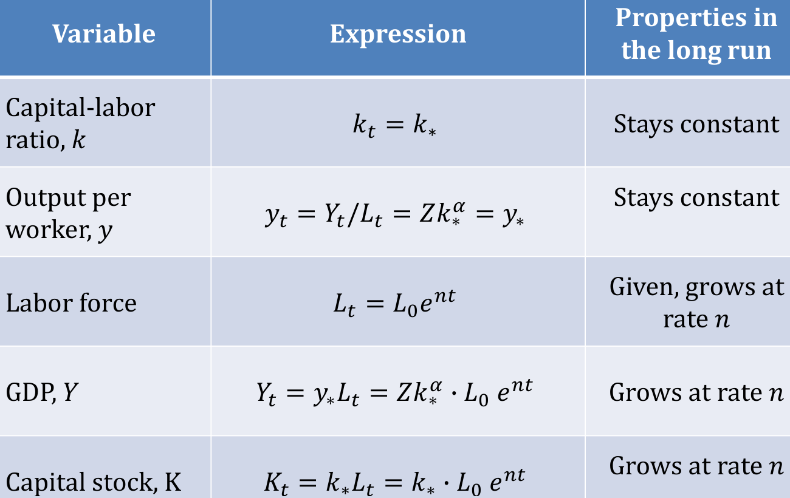{width=50%}

$$\bar{r} = \alpha \frac{g_A + n + d}{s} - d$$


### "Solow Golden Rule"
Golden rule savings rate = The rate of savings that maximizes household consumption. Any savings level above this golden rule is inefficient.

Find Golden rule by taking the derivative with respect to $s$. E.g.,

\begin{align}
k_G &\in \arg\max[ f(k) - (n + d)k] \iff \\
0 &= f'(k_G) - (n+d) \\
f'(k_G) &= n+d \\
\alpha k_G^{\alpha - 1} &= n+d \\
k_G &= [\frac{\alpha}{n+d}]^{\frac{1}{1-\alpha}}
\end{align}

Generally, when $s$ is the golden rule savings rate, $MPk = n + d + g_A$. This makes sense because the benefit of increasing capital comes in the form of higher $MPk$, but this higher level of steady state capital requires more future maintenance (a larger $n + d + g_A$.

In basic Solow the golden rule occurs when $s = \alpha$. So $s> \alpha$ leads to inefficient overaccumulation (Pareto improvement = throw away capital).


### "Solow with Tech Change"
In basic Solow, $k, y$ const, $g_Y = g_L = g_k = n$.

With Cobb-Douglas type of tech change doesn't matter:
$$Y_t = \underbrace{K_t^\alpha(A_t L_t)^{1-\alpha}}_{\text{labor-augmenting}} = \underbrace{A_t^{1-\alpha} K_t^\alpha L_t^{1-\alpha}}_{\text{Neutral}} = \underbrace{(A_t^{\frac{1-\alpha}{\alpha}} K_t)^\alpha L_t^{1-\alpha}}_{\text{capital-augmenting}}$$
re-interpret $k_t$ as $k = \frac{K}{AL}$. Then all analysis still holds, but since $g_{AL} = g_A + n$ we add $g_A$:
$$\dot{k} = sf(k) - (g_A + n + d)$$


### "Constant Growth Path + BGP"
A trajectory in which $Y, C, I, K$ grow at constant (possibly zero and possibly different) exponential rates.

**Prop** If constant growth equilibrium in neoclassical economy with $C_t, I_t > 0$ then we have a BGP with $g_Y = g_K = g_I = g_C$.

> Productivity growth fueled by investment eventually stops (this means $\dot{k} = 0$ in long-run)


### "Uzawa Thm"
If a one-sector model with technological change has a constant growth equilibrium, then technological change has to be labor augmenting.

> Uzawa is a  necessary  condition for constant growth long-run equilibrium

> Uzawa is sufficient if there is a constant growth rate ($s$) as there is in the standard Solow model 


### "Investment-specific technological change (ISTC)"
An improvement in the economy’s ability to produce capital goods out of investment expenditure:
$$\dot{X}_t = q_t I_t - \delta X_t$$
where $q_t$ = efficiency units of capital that can be purchased with one apple of investment expenditure at time $t$.

$$q_t = \frac{P_{C,t}}{P_{I,t}} = \frac{1}{p_{X,t}}$$

> makes capital goods cheaper: as $q_t$ grows, $p_X$ falls

free entry makes price of existing capital $p_X$ equal to its supply cost, $\frac{1}{q_t}$. When supply cost drops, so does the market value of existing capital, $K_t$.


\newpage
# OLG

### "OLG Algorithm"

**UMP**

1. Combine constraints
2. Take FOCs to get Euler Equation
3. Plug $c_1$ into combined constraint and solve for $c_{1,t}, c_{2,t+1}$ in terms of $w_t$.


**Get LOM for $k_{t+1}$ / find steady state**

0. Solve for $a_{t+1}$ in terms of $c_1, c_2, w$
1. Asset market clearing - this is:  $a_{t+1} N_t = K_{t+1}$ (Total Asset Demand = Tomorrow's stock of capital)
2. divide by $L_{t+1}$, plug in expression for $a_{t+1}$ (get this expression from the UMP!)
3. simplify to get LOM for $k_{t+1}$
4. solve for (usually unique) steady state

**Find $\bar{r}$**

1. Start with Jorgy
2. You should have $k_*$ by this point. Just plug in and simplify.

**Pareto-Inefficient?**

1. Compare $\frac{1+\overline{r}}{1+g_Y} = 1$. $\alpha \in (0, \alpha)$ means the eqm you found is Pareto-inefficient because of overaccumulation!


### "OLG Facts"
* Solow-type aggregate dynamics of $k$: unique and globally stable steady state (assuming log preferences)
* Neoclassical production - standard except that it's discrete - can be labor-augmenting: $Y_t = F(K_t, (1+g)^tL_t)$
* Saving: $s_t = \underbrace{r_t a_t}_{\text{capital income}} + \underbrace{w_t l_t}_{\text{labor income}} - c_t$
* LOM for wealth: $a_{t+1} = (1+r_t)a_t + w_t l_t - c_t = a_t + s_t$ (where $a_t$ = stock; $s_t$ = flow)
* $L_t = (1+n)^t \iff \frac{L_{t+1}}{L_t} = 1+n$
* In the canonical model, agents over-save in their youth, leading to a reduction in $MPK$ and a corresponding suppression of the long-term interest rate, $\overline{r}$. Most model extensions correct these inefficiencies by justifying the reason for savings.


> Demand for assets by generation $t$ is $a_{t+1} N_t$!!


### "(Canonical) OLG Household Problem"
$$\max_{c_{1,t}, c_{2, t+1}, a_{t+1}} \bigg(u(c_{1,t}) + \beta u(c_{2, t+1})  \bigg)$$

* $a_{t+1} = (1+ r_t)\underbrace{ a_t }_{\text{initial assets}} +  w_t \underbrace{l_1}_{=1} - c_{1,t}$
* $a_{t+2} = (1 + r_{t+1})a_{a+1} + w_{t+1} \underbrace{l_2}_{=0} - c_{2, t+1}$
* $a_t = 0$, given
* $a_{t+2} \geq 0$ (must bind though since utility maximizer wouldn't die with extra cash)

Simplifies to

* $c_{1,t} = w_t - a_{t+1}$
* $c_{2, t+1} = (1+r_{t+1})a_{t+1}$

Combine to get:
$$PVLC_t = c_{1,t} + \frac{c_{2, t+1}}{1 + r_{t+1}} = w_t = PVLR_t$$


### "OLG Consumption Euler Equation"
$$\frac{u'(c_{2, t+1})}{u'(c_{1, t})} = \beta (1+r_{t+1})$$
Conclusion: optimal consumption profile equalizes marginal utility of wealth across periods

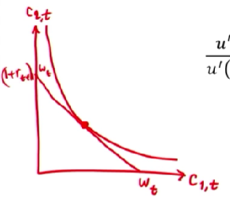{width=25%}


### "OLG Market Clearing"

**Asset Market:**

* Start with $K_t = A_t$ and $K_{t+1} = A_{t+1}$.
* Note that $A_{t+1} - A_t = S_{1, t} +  S_{2, t}$, where
* the old consume all of their wealth and capital income:
    * $S_{2,t} = r_tK_t - c_{2,t} L_{t-1} = -K_t = -A_t$
* the young will own all the assets next period:
    * $S_{1,t} = a_{t+1}L_t = A_{t+1} = K_{t+1}$.
* Which gives the following final form:
$$a_{t+1} L_t = K_{t+1}$$

**Goods Market** (Implied by AMC - observe that $S_1 + S_2 = I$)):
$$Y_t - C_t = I_t$$


### Def "OLG Equilibrium"
The equilibrium consists of quantities $\{c_{1,t}, c_{2,t+1}, a_{t+1}, C_t, L_t, K_t, Y_t, I_t\}, \forall t$ and prices $\{w_t, R_t, r_t\}, \forall t$ such that


1. Households Maximize Utility:
    * $a_{t+1} = \arg \max_{a'} \bigg(u(w_t - a') + \beta u\big((1+r_{t+1})a'\big) \bigg)$
    * GIVEN ($w_t, r_{t+1}$)
2. Production-side equilibrium:
    * **Final goods producers** maximize profits taking $K_t, L_t$ as given: $R_t = MPK_t, w_t = MPL_t, r_t = R_t - d, Y_t = F(K_t, (1+g)^t L_t)$
    * **Capital leasing firms** choose $K_t$ taking $(R_t, r_t)$ as given
3. All markets clear:
    * Asset: $a_{t+1}L_t = K_{t+1}$
    * AMC $\Rightarrow$ GMC


### "Canonical OLG Solution to household problem"
$$a_{t+1} = \frac{\beta}{1+\beta} w_t$$

### "OLG Lifetime Budget Constraint"
$$PVLC_t = c_{1,t} + \frac{c_{2, t+1}}{1+r_{t+1}} = w_t = PVLR_t$$

> Note: PVLR does NOT include interest on savings! Lifetime Resources (LR) includes interest earnings on savings, but PVLR ignores this interest because it's discounted to PV!


### "OLG LOM for Capital"

Aggregate capital accumulation equation is standard: $K_{t+1} - K_t = I_t + dK_t$

intensive capital accumulation equation is usually implicit:

* $a_{t+1} = \hat{a}(w_t, r_{t+1})$ which depends on $k_t, k_{t+1}, t$. So we get
* $\Phi(k_t, k_{t+1}; t) = 0$

which means multiple equilibria are possible... log preferences fix this!

### "OLG Intensive Form"
$$k_t = \frac{K_t}{(1+g)^t L_t}; y_t = \frac{Y_t}{(1+g)^t L_t}$$


### "OLG LOM for Capital, Log Preferences"
\begin{align}
K_{t+1} &= a_{t+1} L_t \\
&= \frac{\beta}{1+\beta} w_t L_t \tag{Sol to HH problem}\\
&= \frac{\beta}{1+\beta} (1-\alpha) Y_t \\
\end{align}
So,
\begin{align}
k_{t+1} &= \frac{\beta(1-\alpha)}{1+\beta} \frac{Y_t}{(1+g)^{t+1} L_{t+1}} \\
&= \frac{\beta(1-\alpha)}{1+\beta} \frac{Y_t}{(1+g)^{t+1} L_{t+1}} \frac{(1+g)^t L_t}{(1+g)^t L_t} \\
&= \frac{\beta(1-\alpha)}{1+\beta} \frac{y_t}{(1+g)(1+n)} \\
&= \frac{\beta(1-\alpha)}{1+\beta} \frac{y_t}{1+ g +n + gn} \\
&\approx \frac{\beta(1-\alpha)}{1+\beta} \frac{y_t}{1 + g + n + 0} \\
&\approx \frac{\beta(1-\alpha)}{1+\beta} \frac{y_t}{1 + g_Y} \tag{On BGP} \\
&= \frac{\beta(1-\alpha)}{1+\beta} \frac{k_t^\alpha}{1 + g_Y} \\
\end{align}


### "OLG Golden Rule"
In canonical model, $\bar{r} = g_Y$ (since $g_Y = n$ and using Jorgenson's). $\bar{r} < g_Y \Rightarrow$ oversaving - Pareto improvement is to throw away capital.


As in Solow, the golden rule capital-labor ratio $k_G$ is the capital-labor ratio that maximizes the long-run consumption-labor ratio, $c$.

> Economic intuition for Pareto inefficiency: lack of resources in old age and no opportunities to borrow drive excessive saving.


### "OLG and Efficiency"
The OLG model has infinitely many Pareto efficient consumption plans.

$\bar{r} < g_Y$ is Pareto-inefficient. Note that competitive equilibrium results in $\bar{r} < g_Y$, so competitive equilibrium is inefficient. Just consume excess capital today and everyone is better off.


> an increase in $r$ results in a DECREASE in investment!!!!!!!!! (higher prices $\Rightarrow$ lower demand)


### "OLG with Government Debt"
$D_{t+1} = (1+r_t)D_t + G_t - T_t$

$G_t > T_t$ means the government has a deficit


LOM for debt: $D_{t+1} - D_t = r_t D_t + G_t - T_t$

> Government debt does not depreciate


### "Service Fee"
$r_t D_t$ is the *service fee* on debt.


<!-- Life-cycle model vs. dynastic model of households -->

### "OLG with bequests"
$$U = u(c_{1,t}) + \beta u(c_{2,t+1}) + \beta (1+n) \varphi U_{t+1}$$
where $\varphi$ = intergenerational discount factor (aka altruism)

Recursive structure makes this an infinite horizon problem:
$$U_t = \sum_{s=t}^\infty (\beta \varphi (1+n))^{t-s} [u(c_{1,s}) +  u(c_{2, s+1})]$$

Choice vars: 

* $\{c_{1,t}, c_{2, t+1}  \}_{t=0}^\infty$
* $\{a_{t+1}  \}_{t=0}^\infty$ = assets carried into old age by generation $t$
* $\{b_{t+1}  \}_{t=0}^\infty$ = bequests PER PERSON


Variables known to decision-maker:

* $b_0$
* $\{w_{t}, r_{t+1}  \}_{t=0}^\infty$


Simplification:

* set $g=0$ so that $g_Y = n, c_{1,s} = \overline{c}_1, c_{2,s+1} = \overline{c}_2$

So, max problem is subject to:

$$a_{s+1} = b_s + w_s - c_{1,s}$$
$$c_{2,s+1} = (1 + r_{s+1})a_{s+1} - (1+n)b_{s+1}$$

Take FOCs and get:

1. (inverted??) Euler equation:

$$\frac{u'(c_{1,s})}{u'(c_{2,s+1})} = \beta (1 + r_{s+1})$$
2. Intergenerational Euler Equation:

$$\frac{u'(c_{1,s})}{u'(c_{1,s+1})} = \beta \varphi (1+r_{s+1}), \forall s \geq t$$
*notice both consumptions are subscripted with the "1"

> Optimal bequest equalizes the marginal utility of date-$t$ wealth across the current and the future generation.


\newpage
# Optimal Control


### "Optimal Control Terms"
* $\bar{k}$: max debt constraint or min wealth constraint IN TERMINAL STATE
* $\Gamma$: law of motion for capital/wealth/the state variable: $\Gamma(k_t,c_t,t) = \dot{k}$
* $\lambda_t$: marginal benefit of one unit of $k_t$
* $\lambda_t k_t$ = agent's wealth measured in units of utility (i.e., potential to receive future utility)


### "Hamiltonian"
$\mathcal{H} = u + \lambda \Gamma$ is the Hamiltonian

FONC interpretation:

* $\lambda_t$ = marginal benefit of one unit of $k_t$
* $\lambda_t k_t$ = agent's wealth measured in "utils" (i.e., potential to receive future utility)


### "Standard dynamic optimization problem"

* State: $k_t$; Control: $c_t$
* Solution is a decision rule: $c_t = \hat{c}(k_t)$
* Equality constraints describe the LOM for the state: $\Gamma(k_t, c_t, t) = k_{t+1} - k_t$

<!-- 4-term representation of the Lagrangian: -->

<!-- 1. head -->
<!-- 2. Hamiltonian -->
<!-- 3. co-state -->
<!-- 4. tail -->


<!-- ### "Principle of optimality" -->
<!-- Continuation trajectory solves continuation problem. -->

<!-- Let $\hat{k}_t$ be the solution to $V(k_0, t_0) = \max_{c_t} \int_{t_0}^T u(k_t, c_t, t) dt$ subject to $\dot{k} = \Gamma(k_t, c_t, t)$ and $k_0$ given. -->

<!-- Then, for any $\tau \in [t_0, T]$: -->
<!-- $$V(k_0, t_0) = \int_{\tau}^T u(\hat{k}_t, \hat{c}_t, t) dt +  V(\hat{k}_t, \tau)$$ -->

<!-- > useful for corners, discontinuity, etc. -->


### "End Point (Transversality) Conditions"

* Constrained end-point (original problem)
    * $\lambda_T(k_T - \bar{k}) = 0$
* Salvage Value
    * $S(k_T)$ - endpoint constraint replaced by some known function for the salvage value
* Free end-point
    * $\lambda_T = 0$
* Infinite horizon
    * $\lim_{t\rightarrow \infty} \mathcal{H}(\hat{k}_t, \hat{c}_t, \hat{\lambda}_t, t) = 0$ - hard to solve this one
    * but, if you have an objective with exponential decay (e.g., $u(k,c,t) = e^{-\rho t} f(k, c)$) we can use: $\lim_{t\rightarrow \infty} \hat{\lambda}_t \hat{k}_t = 0$.


Usually have:

* Planner's problem: $\lim_{t\rightarrow \infty} \lambda k = 0$
* HH problem: $\lim_{t\rightarrow \infty} e^{\overline{r}(0,t)}a_t = 0$


\newpage
# Ramsey

### "Ramsey Algorithm"

**Planner's Problem**

0. Change of variables: $L_t = H * l_t$ and $C_t = H * x_t$
1. Transition $K$ to $k$
2. Solve Planner's Problem
    1. Derive EE
    2. Get two DEs:
        1. $\frac{\dot{c_t}}{c_t} = \alpha k^{\alpha - 1} - d - \rho$
        2. $\dot{k_t} = k_t^\alpha - c_t - (n+d)k_t$

**Household Problem**

1. assert equilibrium (assume $a_{it} = a_t$ which implies $c_it = c_t = \frac{C_t}{L_t}$)
2. Derive EE (should look like planner's problem, but with $\varepsilon_u$ replacing $\theta$)
    1. May need to provide LOM for $\dot{A}$ given only a LOM for $\dot{K}$. This requires AMC.
3. Use AMC to convert $A$ to $K$ and then derive LOM for $\dot{k}$
4. Should now have two DEs:
        1. $\frac{\dot{c_t}}{c_t} = \alpha k^{\alpha - 1} - d - \rho$
        2. $\dot{k_t} = k_t^\alpha - c_t - (n+d)k_t$
    

**Phase Diagram**

1. Derive isoclines. 
    1. CAUTION: If you have a general $f'(k)$, plug Cobb-Douglas in (on scratch paper) and solve for $k_*$ to be sure you know which way the vertical isocline moves.
    1. $\dot{c} = 0 \Rightarrow k = (\frac{\alpha}{d + \rho})^{\frac{1}{1-\alpha}}$ (hint: make sure exponent is positive)
    2. $\dot{k} = 0 \Rightarrow c_t = k_t^\alpha - (n+d)k_t$
2. Draw new isoclines and arrows; DON'T DRAW TRAJECTORY YET!


**Time Paths if Surprise change:**

1. This is rare. Make sure you read the question properly. If so, jump automatically to new SA, otherwise will never get there.
2. Exception: a nondistortionary tax implemented without pre-announcement won't change anything, so no jumps.

**Time Paths if Pre-announced change:**

1. At $t_C$:
    i. $c_{t_C}$: check for
        i. Jump: set $\lambda_{t_C-0} = \lambda_{t_C+0}$ to see if $c_{t_C}$ jumps (rare that it does)
            a. jumps if param changes make $u_c, \Gamma_c$ discontinuous (e.g., pre-announced sales tax jump or other param change that make marginal utility jump). *(Japan example)* 
                * Compare $\lambda_{t_C-0}$ and $\lambda_{t_C+0}$ to be safe
        ii. Kink: if $\dot{c}$ jumps, KINK (get direction from PD)
    i. $k_{t_C}$: 
        i. Jump: assert no jump
        ii. Kink: if $\dot{k}$ jumps, KINK (get direction from PD)
2. Between $t_C$ and $t_A$, governed by OLD arrows
    i. If one isocline moves before the other draw only the intermediate arrows (use pencil)
3. At $t_A$:
    i. $c_{t_A}$: check for
        i. Jump: USE LOGIC (also ask: where should you be at $t_{c-0}$ to reach the new stable arm?)
        ii. Kink: rare, since usually jumps; if $\dot{c}$ jumps, KINK (get direction from PD)
    i. $k_{t_A}$: 
        i. Jump: assert no jump
        ii. Kink: if $\dot{k}$ jumps, KINK (get direction from PD)
            a. NOTE: if $c$ jumps, KINK!

> $c$ and $\lambda$ always jump/stay together so long as utility is strictly increasing (it always is!)

* $k, w$ nearly always move together
* $k, r$ nearly always move opposite


**Convexity/Concavity of trajectory on $t \in [t_A, t_C]$**

1. start with EE: $\dot{c} = \frac{1}{\theta}c_t(r_t - \rho)$ where $r_t = f'(k_t) - d$
2. Differentiate wrt $t$
3. Look at signs of everything
    * Should know $\dot{c}$ and $\dot{k}$ based on arrows. If not, ask: 
        * $\dot{c}$: what happens to your consumption while you await the change? 
        * $\dot{k}$: what happens to your wealth while you await the change?
    * $\dot{r}$: this is opposite of $\dot{k}$ (think IS-LM curve)
    * sign of $r_t - \rho$?
        * if to the left of vertical isocline: $r_t < \rho$
        * if to the right of vertical isocline: $r_t > \rho$


### "Ramsey Facts"
* representative dynasty
    * the only heterogeneity this model can handle is in "income," but even then, income ratios must stay constant over time
* no welfare thm guarantees equilibrium will be Pareto-optimal, but it is optimal nonetheless

* $x_t$: household consumption - CONTROL! but we replace this with $C_t$ and then $c_t$.
* $K_t$: wealth - STATE! replace with $k_t$
* $H$: total number of households
* $l_t$: household size (exogenous)
* $L_t = 1 *l_t * H$ (1 = labor supply per person)
* $C_t = Hx_t$
* $c_t = \frac{C_t}{e^{g_t}L_t}$
* $k_t = \frac{K_t}{e^{g_t}L_t}$
* $f(k_t) = y_t = \frac{Y_t}{e^{g_t}L_t}$
* $\rho$: time discounting (impatience)
* $\theta$: IES intertemporal elasticity of substitution
* $\theta=-{\frac {u_{c}(c)}{c\cdot u_{cc}(c)}}=-{\frac {d\ln c}{d\ln(u'(c))}}$
* $\frac{\dot{c}}{c}+g$: growth rate of per-capita consumption
* $\vec{\alpha} = (\rho, \theta, n, d, g)$ ALL ARE EXOGENOUS
* $PD(\vec{\alpha})$: phase diagram for comparative dynamics
* $\lambda$: MU of wealth
* $U$ = household utility, $u$ = individual utility

The solution is $\hat{c}(k_t) = SA(k_t; \alpha)$.

### "Ramsey Assumptions"
* Identical preferences $\Rightarrow$ there exists a representative household $\Rightarrow$ *behavior depends only on aggregate wealth $K_t$*
      * Conditions for existence of representative household without assuming identical preferences are only slightly less restrictive than assuming identical preferences
      * Requires that household wealth be proportional and income ratios must stay constant over time
* Large number of households
* Infinite horizon (care about offspring just as much as you care about yourself)
* Time-separable utility (utility does not depend on history of past consumption)
* Inelastic labor supply (*Uzawa still applies* so we'll have BGP)


### "Ramsey Household Utility"
$$U(x, l) = l \cdot u(\frac{x}{l})$$

where $x$ represents household expenditure and $l$ is the size of the household. 

*Functional form for utility of the INDIVIDUAL:* $u(c) = \frac{c^{1-\theta} - 1}{1-\theta}$

Note: $\lim_{\theta \rightarrow 1} \frac{c^{1-\theta} - 1}{1-\theta} = \ln c$


### "Ramsey Market Clearing"
Asset:
$$A_t = K_t$$
Implies Goods market (just like in OLG):
$$Y_t = C_t + I_t$$

> In planner's problem we only use goods market condition!

> In HH problem we use AMC.


## Planner's Problem

### "Planner's Problem"
The planner's problem is to max discounted utility for each household.

Start with:
$$\max_{x_t} \int_t^\infty e^{-\rho t} H\cdot l_t \cdot u(\frac{x_t}{l_t})dt \text{    s to } \dot{K} = F(K_t, e^{gt}L_t) - x_t H -  dK_t$$
Replace $x_t H$ with $C_t$ and $l_t H$ with $L_t$:
$$\max_{C_t} \int_t^\infty e^{-\rho t} L_t \cdot u(\frac{C_t}{L_t})dt$$

Then convert to intensive form:
$$\max_{c_t} \int_t^\infty e^{-\rho t}e^{nt} u(c_t)dt$$

which, using CRRA parametrization and dropping constants that aren't useful gives
$$\underbrace{V(k_0, t)}_{\text{indirect utility}} = \max_{c_t} \int_t^\infty e^{-\rho t}e^{nt}\frac{(c_t e^{gt})^{1-\theta}}{1-\theta} dt$$

subject to:

1. $\dot{k}_t = f(k_t) - c_t - (n+d)k_t$
2. $k_0 >0$ given
3. $\lim_{t \rightarrow \infty} \lambda_t k_t$ (transversality condition with exponential discounting)
4. implicitly: $k_t, c_t \geq 0$ - will never bind due to Inada so we usually ignore them


$\mathcal{H} = U + \lambda \dot{k}$ gives:

* $\frac{\partial \mathcal H}{\partial c_t} = 0$
* $\frac{\partial \mathcal H}{\partial k_t} = -\dot{\lambda}$
* $\frac{\partial \mathcal H}{\partial \lambda_t} = \dot{k_t}$

> The reason it works: no conflict between agents' interests. Since all agents agree, planner acts on behalf of representative household by prescribing how much to save/consume in every period.


> MU of consumption = $MU_t = \lambda_t$ = MU of wealth!


### "Necessary condition for Ramsey integral convergence:"
$$g(1-\theta) + n - \rho < 0$$

On the BGP, TVC is satisfied when $\bar{r} > g_Y$

> this condition is also necessary for an interior solution


### "Euler Equation for Consumption (Solution to the Ramsey Problem)"
$$\frac{\dot{c_t}}{c_t}=\frac{1}{\theta}(r_t- (\rho + \theta g ))$$

Often written as
$$\underbrace{\frac{\dot{c_t}}{c_t} + g}_{\substack{\text{growth rate per} \\\text{capita consumption}}} =\frac{1}{\theta}(r_t- \rho)$$


ALWAYS CHECK THAT EE SAYS THINGS THAT MAKE SENSE:

* Higher $\rho$ higher means $\frac{\dot{c}_t}{c_t}$ is lower (makes sense bc higher discounting means you don’t want growth of consumption to be as large (you would rather consume today))


### "Intertemporal elasticity of substitution"
$\theta$ = IES, i.e. elasticity of the marginal utility ratio with respect to consumption growth.


* Higher $\theta$ means the agent dislikes volatile consumption (i.e. they really really want consumption to be smooth and are very inelastic to changes in the interest rate).
      * $\theta$ measures sensitivity to changes in consumption
* $\theta \in (0, \infty)$


### "Phase Diagram Equations (steady state)"

$$\dot{k} = 0 \iff c_t = f(k_t) - (n + d + g)k_t$$
$$\dot{c} = 0 \iff k_t = k_*, \text{ where } f'(k_*) = d + \rho + \theta g$$
$$c_* = f(k_*) - (n+d+g)k_*$$


### "Ramsey Key Equations"
LOM for capital:
$$\dot{K} = I - dK = Y - C - dK$$

LOM for capital, intensive form:
$$\dot{k_t} = \underbrace{f(k_t) - c_t}_{\substack{\text{actual investment} \\ \text{per effective worker}}} - \underbrace{(n+d+g)k_t}_{\substack{\text{replacement investment} \\ \text{per effective worker}}}$$

Production Function/Total Output
$$Y = F(K, e^{gt}L) = C_t + I_t$$


### "Ramsey Golden Rule vs Steady State Capital"
golden rule level of capital is the level that maximizes consumption:
$$k_G = \arg \max_{ c^* }= \arg \max f(k^*) - (n + d + g)k^* \Rightarrow f'(k_G) = n + d + g$$

Recall from planner's problem: $f'(k_*) = d + \rho + \theta g$. So 
$$f'(k_*) > f'(k_G) \iff \rho > n + (1-\theta)g$$


### "Ramsey Isoclines"
* $\dot{k} = 0$: $c_t = f(k_t) - (n+d+g)k_t$
* $\dot{c} = 0$: $r = \rho + \theta g$ or $k_t=k_*$, where $f'(k_*)=d+\rho + \theta g$

> Usually, $g = 0$, especially if you get the EE from the consumer max problem.

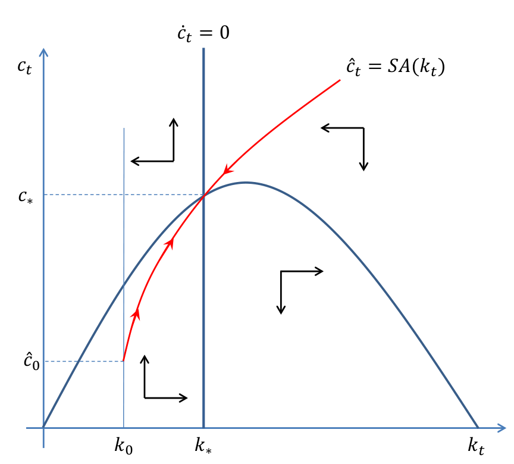{width=25%}


* consumption is rising when steady state capital is low since low capital means high MPK
* capital is rising when steady state consumption is low because we are accumulating capital instead of consuming it


### "Ramsey Parameters"
There are only 5 parameters that shift the isoclines:

1. $\rho$: ??
2. $\theta$: ???
3. $n$: affects just $\dot{k} = 0$ because it affects replacement investment
4. $d$: affects just $\dot{k} = 0$ because it affects replacement investment
5. $g$: affects both because it affects both $\overline{r}$ and replacement investment


### "Ramsey Comparative Dynamics"

1. Unanticipated Permanent Change
    i. $c, \lambda$ must jump to new SA (otherwise will never get there)
    ii. Exception: a nondistortionary tax implemented without pre-announcement won't change anything, so no jumps.
2. Anticipated (Pre-Announced) Permanent Change
    i. At $t_C$
        * $c, \lambda$ typically continuous. Two exceptions:
            * capital jumps (won't happen) or
            * param changes make $u_c, \Gamma_c$ discontinuous (e.g., pre-announced sales tax jump or other param change that make marginal utility jump). *(Japan example)* 
                * Need to compare $\lambda_{t_C-0}$ and $\lambda_{t_C+0}$ to be safe
    ii. At $t_A$
        * Plausible behavior includes: (1) staying, (2) jumping up, (3) jumping down. Often can't tell which of 2 or 3 is correct.


IMPORTANT:
* $k, w$ nearly always move together
* $k, r$ nearly always move opposite


> $c$ and $\lambda$ always jump/stay together so long as utility is strictly increasing (it always is!)

<!-- * $c$ jumps if parameter changes make $u_C, \Gamma_C$ discontinuous (e.g. pre-announced jump in sales tax rate or a parameter change making marginal utility jump) -->


<!-- Example: $n$ falls to $n'$ at $t_C > t_A$. Then,  -->

<!-- * MU: falls, no jump (since $e^{-\rho t} L_t u'(c_t)$ unaffected by $n$ except the $L_t$ term which decreases, but not suddenly) -->
<!-- * $\Gamma_C = 1$: this is always true in planner's problem. -->
<!-- * So, no jump -->


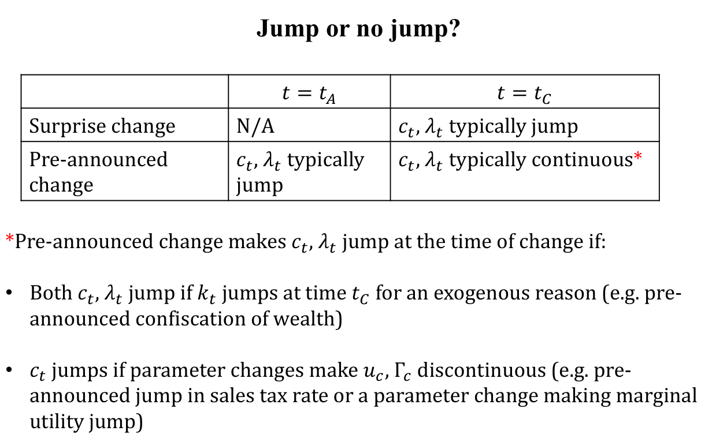{width=50%}


> remember: moving to a steady state happens asymptotically, so any rate of change will be declining.


### "Assorted explanations of consumption behavior at $t_A$"

All of the following are pre-announced (at $t_A$) changes (at $t_C$):

* Pre-announced increase in tax on final goods
    * $c_t$ jumps up
        * The anticipated rise in tax weakens the incentive to accumulate wealth (because the effective interest rate is lowered). At TA, the household anticipates that its long-run desired wealth is now lower and raises consumption right away.
* Pre-announced decrease in $n$
    * $c_t$ jumps up 
    * know there will be fewer mouths to feed soon, adjust consumption right away
* ADD MORE HERE INCREMENTALLY! FINISH


## "Ramsey - Competitive Equilibrium/Household Expectations"

### "Ramsey Household Facts"

* $c_{it}$: per-capita consumption (not consumption per effective worker)
* $g$: tech growth. We usually assume $g = 0$ - no technology growth in the consumer problem so the Euler equations of the Household and Planner coincide.
* $\varepsilon_u = \big|\frac{u''(c_{it})c_{it}}{u'(c_{it})}\big|$: elasticity of Marginal Utility growth wrt consumption growth. If $\varepsilon_u$ rises, then consumption growth is less sensitive to changes in the interest rate. In other words, consumers prefer smooth consumption despite time-varying interest rates. 
    * Same thing as $\theta$ in the planner's problem!
* $\Phi(K):$ an expectation/belief function that allows households to forecast future factor prices


### Def "Representative Household flow budget constraint"
$$\dot{A_t} = r_tA_t+w_tL_t - C_t$$


### "Ramsey Household Utility Maximization"
$$\max_{c_{it}} \int_0^\infty e^{-\rho t} L_{it}u(c_{it})dt \text{ s. to: }$$

1. $\underbrace{\dot{A_{it}}}_{\text{rate of change of assets}} = \overbrace{\underbrace{r_tA_{it} + w_t L_t}_{\text{Income}} - \underbrace{c_{it}L_{it}}_{\text{Consumption}}}^{\text{Savings flow}}$ (aka household flow budget constraint) DON'T USE $\dot{K}$ here!! 
2. $A_{i0}$: given
3. $\lim_{T \rightarrow \infty} e^{-\bar{r}(0,T)}A_{it}\geq 0$ ($=0 \iff PVLC = PVLR$)

* Individual State Variable: $A_{it}$
* Aggregate state variables: can use $r_t, w_t$ or $K_t, L_t$. Both will give the same answer, but we use $K_t, L_t$ in this class.

<!-- Household's Utility Maximization Problem FOCs: -->

<!-- * $\frac{\partial \mathcal H}{\partial c_{it}} = 0 \iff$ -->
<!-- * $\frac{\partial \mathcal H}{\partial A_{it}} = -\dot{\mu_{it}}$ -->


### "Euler Equation for Consumption (Solution to the Ramsey Problem)"

$$\frac{\dot{c_{it}}}{c_{it}} = -\frac{u'(c_{it})}{u''(c_{it})c_{it}}(r_t - \rho) = \underbrace{\frac{1}{\varepsilon_u}(r_t - \rho)}_{\text{sign flipped due to abs val}}$$

where $\varepsilon_u = \big|\frac{u''(c_{it})c_{it}}{u'(c_{it})}\big|$

> This is identical to the Euler equation in the planner's problem if $g = 0$ and $\theta = \varepsilon_u$.

<!-- > EE boils down to: growth rate of MU = growth rate of price of consumption ($r$?) -->


<!-- ### "Ramsey Household Asset Market Clearing" -->
<!-- $$A_t = K_t$$ -->
<!-- Technically also have the capital leasing sector which requires -->
<!-- $$A_D = K_t \text{ and } L_D = L_t$$ -->

<!-- ### Ramsey Capital leasing max problem  -->
<!-- Idk if this is important, so don't get sidetracked, but here it is: -->

<!-- $$\max_{A_D}(R_t - r_t - d)A_D$$  -->
<!-- where $A_D$ is the decision of the capital leasing firms. -->


### Def "Competitive (Walrasian) Equilibrium"
Competitive equilibrium is a list of quantities $\{C_t, Y_t, I_t, K_t, A_t\}$ and prices $\{w_t, r_t, R_t\}$ such that

1. $\{C_t, A_t\}$ solves the household problem given $\{w_t,r_t\}$
2. Production side equilibrium holds for all $t$
    1. see production side equilibrium! very long but needs to be included here I think!
3. Market clearing for all $t$
    1. $A_t = K_t \Rightarrow Y_t = C_t + I_t$
    
    
> Household $i$ is the representative household, so $c_t = c_{it}, C_t = c_{it} L_{it}; A_t = A_{it}$.


### Def "Ramsey: Production Side Equilibirum"
A list of quantities $\{C_t, Y_t,K_t\}$ and prices $\{w_t, r_t, R_t\}$ satisfying, for all $t$:

1. Aggregate production function: $Y_t = F(K_t, L_t)$
2. Profit maximization and factor market clearing
    1. Final goods sector: $(K,L) \in \arg \max_{(K,L)}(F(K,L) - R_tK - w_tL)$ given $(w_t, R_t)$
    2. Value maximization and asset market clearing, capital leasing: $K_t \in \arg \max_{A_D}(\int_t^\infty e^{-\bar{r}(t,s) - d(s - t)} R_s A_D ds - A_D)$ given $(r_t, R_t)$
3. Free entry (automatic given profit maximization and market clearing)
    1. $\max_{(K,L)}(F(K,L) - R_tK - w_tL) = 0$


### "Ramsey - differences between Planner and Household Problems"

If we have (1) production side equilibrium, and (2) Asset market clearing ($A = K$), then planner and household have the same (1) utility, (2) LOM for wealth ($\dot{K}$), (3) transversality condition.

Careful: if we don't have asset market clearing and/or production side equilibrium, HH would have different resources and the stable arms would not coincide.


* Planner's Solution describes equilibrium *quantities*. Prices are chosen to decentralize planner's allocation as competitive equilibrium
* Unique Pareto Optimum $\Rightarrow$ will also be a competitive equilibrium
* TVC: Prod-side eqm and Asset market clearing make it so TVCs are identical

<!-- * Controls -->
<!--     * Planner: $c$ -->
<!--     * Household: own financial wealth and agg wealth -->
<!-- * States:  -->
<!--     * Planner: ???????? -->
<!--     * Household: individual state: $A_{it}$; aggregate states: $K/R, L/w$ (generally easier to use $R$ and $w$) -->
<!-- * TVC: -->
<!--     * Planner: -->
<!--     * Household: $\lim_{T \rightarrow \infty}$  holds iff $PVLC = PVLR$ -->


### Def "Rational Expectations Equilibrium (REE)"
Refinement of WE - we add an expectation/belief function $\Phi(K) = c_t, C_t = \Phi(K_t) L_t$ that allows households to forecast future factor prices

Explains how households know future factor prices.

REE is also WE.

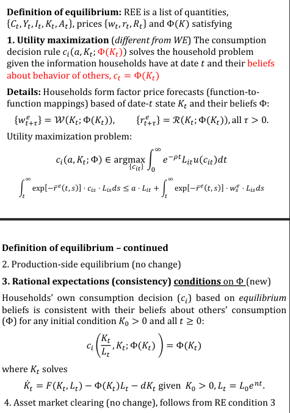
<!-- FINISH MEE -->

> WE equipped with a belief equal to the stable arm is a REE.


## Government and fiscal policy in the Ramsey model


### "Government Budget Balance"
$$G_t = \tau_{A,t} \cdot r_t A_t + \tau_{w,t} \cdot w_t L_t + \tau_{c,t} \cdot C_t + T_t$$

Where:

* $\tau_{A,t}$ = tax on assets (or, equivalently, on capital income)
* $\tau_{w,t}$ = tax on labor income
* $\tau_{c,t}$ = tax on consumption (sales tax)
* $T_t$ = lump-sum tax if positive, or transfer if negative

If taxes are collected in excess of $G$ then excess is distributed back to households via transfers, $T_t$


### "Ramsey Household problem with taxes"
same as before, but now:

$$\dot{A}_{it} = (1 - \tau_{A,t}) \cdot r_t A_{it} + (1 - \tau_{w,t}) \cdot w_t L_{it} + \underbrace{(1 + \tau_{c,t})}_{\text{Note "+"}} \cdot c_{it} L_{it} + T_t$$

> Caution: common mistake is to plug in $A_t$ instead of $A_{it}$... this mistake will usually show no effect of taxes

Instead, need to (1) solve HH problem, (2) aggregate decisions


### "Which taxes distortionary?"
Nondistortionary = behavior of the household agrees with planner's optimum despite taxes being present in the household's budget constraint (Planner doesn't care about taxes--so we're talking just about households).

In general need to solve and do phase diagrams to solve. But, should also memorize the following:

* asset (wealth/capital income) tax: distortionary! New EE is
    * $\frac{\dot{\mu}_{it}}{\mu_{it}} = \underbrace{(1-\tau_A) r_t}_{\text{after-tax interest rate}}$
* wage tax: NOT distortionary (since labor supply is GIVEN--not a choice variable)
* sales tax: NOT distortionary IF constant rate (bc when differentiating over time, the term will disappear--it won't affect the relative price of consumption)
* lump sum tax: NEVER distortionary

*Alternative definition*: a tax system is nondistortionary if and only if the competitive equilibrium is Pareto optimal.


### "Government in Planner's and HH Problems"

*Assume*: $G_t$ does not depend on aggregate state.

<!-- *Result 1*: If government budget is balanced, the $\dot{k} = 0$ isoclines for the household and the planner coincide. -->

<!-- *Result 2*: If taxes are non-distortionary, the $\dot{c} = 0$ isoclines for the household and the planner coincide. -->

Non-distortionary AND budget balanced $\Rightarrow$ both isoclines coincide


### "Proposition: nondistortionary taxes = reduction in initial wealth"
If taxes are non-distortionary, the effect of taxes is just like a reduction in initial wealth


### "Government Debt in Ramsey"
Households can hold wealth in the form of $K$ or $D$.

Asset market clearing:
$$A_t = K_t + D_t$$
Asset market clearing requires (no arbitrage between the two assets):
$$r_t = r_{K,t} = r_{D,t}$$
LOM for Gov Debt:
$$\dot{D}_t = r_t D_t + G_t - T_t$$

Government cannot roll over debt indefinitely in Ramsey! No Ponzi!

### Thm "Ricardian Equivalence theorem"
If taxes are non-distortionary, then

1. $D_t$ has no effect on the household lifetime budget constraint, and
2. The solution to the household problem with taxes corresponds to the Pareto optimal quantities


Implication: If taxes are non-distortionary, the amount and timing of intergenerational transfers implemented through $D_t$ (e.g. Social Security, Medicare) does not affect the economy’s consumption and interest rate trajectory. Sorta makes sense: dynastic households receiving a stimulus today will save it instead of spending so that their progeny will be able to pay off the debt later.


<!-- ### "Irrelevance result" -->
<!-- eqm allocations and prices do not depend on the level of gov debt under certain conditions... -->


\newpage
# Endogenous Growth (EG)

## Endogenous Growth Intro

### "EG Algorithm"

**Household Problem**

1. setup Hamiltonian with $V = K + P_A A$ as the only state, subject to $\dot{V}$ (don't need to get into intensive form!)
    1. Note: you'll probably need to combine $\dot{K}$ and $\dot{A}$ to derive LOM for $V$!
2. This gives 5 differential equations, 5 algebraic equations. Can't solve, so guess BGP and check.


**Planner's Problem**

1. setup Hamiltonian with two states ($A$, $K$) and two constraints ($\dot{A}, \dot{K}$)
2. eliminate $\mu_K$ to get EE
3. eliminate $\mu_K$ to get $\frac{\dot{\mu}_A}{\mu_A} = - \frac{z}{w} \frac{\partial Y}{\partial A}$.
    a. recall: social value of idea, $P_A^* = \frac{\mu_A}{\mu_K}$
4. derive LOM for $P_A$ (use fact that $g_{P_A} = g_{\mu_K} - g_{\mu_A}$)
    a. $\dot{P}_A^* = r_t P_A^* - \underbrace{\frac{z}{w}P_A^*}_{=1} \frac{\partial Y}{\partial A} = r_t P_A^* - \frac{\partial Y}{\partial A}$

**Derive $\overline{r}$**

1. Start with Euler
2. Invoke BGP
    a. DON'T MAKE THE MISTAKE OF SAYING $\dot{c}=0$!!
3. By BGP, $g_c = g_{C/L} = g_Y - n = g_A$
4. Derive $g_A$
    a. trick is to assert $g_A$ is const, divide $\dot{A}$ by $A$, then log-diff


**Important to have memorized**

* $\dot{V} = rV + wL - cL$
* $\dot{P}_A = -\pi + rPA$
* $P_A^*=PV(\{\frac{\partial Y}{\partial A} \}) + PV(\{ P_A^* * \frac{\partial \dot{A}}{\partial A}\})$
* $g_Y = g_A + n$

### "Endogenous Growth Facts"

* $A$: patent number (index)
* $P_{A,t}$: price of idea
* $M = P_AA$ market value of patents
* $\varphi$: Knowledge externality. Standing on shoulders or fishing.
* $\lambda$: Labor externality. Stepping on toes or synergy.
* $\theta$: CRRA coefficient - same as in Ramsey - shows up only in planner's problem
* $\rho$: same as in Ramsey, part of EE
* $x_j = \frac{K}{A}, \forall j = 1, ..., A$. Symmetry $\Rightarrow \sum x_j = A x_j = Ax = K$
* $\bar{r} = \rho + \theta g_A$ (in standard planner's problem)
* $w = (1-\alpha)Y$ (by profit max in final goods)
* $wL_A = P_A\dot{A}$ (by free entry in research sector)


Marginal products of labor are equal across sectors in standard models, but be careful to not assert that $w = MPL_Y = MPL$ without checking things first...

<!-- > Mechanism of growth: $A \uparrow \Rightarrow x_j = \frac{K}{A} \downarrow \Rightarrow MPx_j \uparrow \Rightarrow Y \uparrow$ (don't get this backwards!) -->

> wages always equal; interest rate on assets always equal; but capital income rates not equal - physical capital will be higher (since $d$ added to $R$ and $\frac{\dot{P}_A}{P_A}$ subtracted from patent return rate)!

> EG model will have inefficient equilibrium - but this time not related to oversaving, rather having to do with production of ideas and wrong incentives


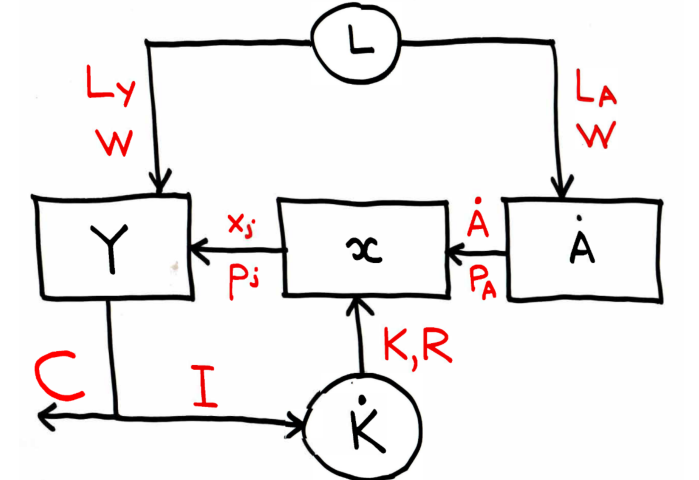{width=50%}

### "EG Market Clearing"
Asset:
$$V = K + P_AA$$

Goods (implied by AMC):
$$Y = C + I \neq GDP$$

Capital:
$$x_1 + \cdot \cdot \cdot + x_A = Ax = K$$

Labor:
$$L = L_A + L_Y$$


### "EG Final Goods Sector (1/4)"

$$Y = L_Y^{1-\alpha} \sum_{j=1}^A x_j^\alpha = L_Y^{1-\alpha} (x_1^\alpha + \cdot \cdot \cdot x_A^\alpha)= L_Y^{1-\alpha} \sum_{j=1}^A \bigg(\frac{K}{A}\bigg)^\alpha  =  L_Y^{1-\alpha} A \bigg(\frac{K}{A}\bigg)^\alpha = K^\alpha(AL_Y)^{1-\alpha}$$

Max problem is
$$\max_{L_Y, x_j} \bigg (  L_Y^{1-\alpha} \sum_{j=1}^A x_j^\alpha - wL_Y - \sum_j^A p_j x_j \bigg )$$

Competitive, so $w = MPL = (1-\alpha) \frac{Y}{L_Y}$ and $p_j = MPx_j = \bigg( \frac{L_Y}{x_j} \bigg)^{1-\alpha}$


### "EG Capital Goods Bundling Sector (2/4)"

$A$ monopolists own one of $j = \{1, ..., A\}$ ideas, purchased at price $P_{A,t}$.

Two max problems:

1. determines price at which to buy a patent
2. determines rental fee on each bundle


**1. Determining price at which to buy a patent:**

$$\text{Lifetime Profit} = \max_{\{  x_t, p_t \}} PV(\{\pi_t\}) - P_{A,t} \tag{1}$$

> Free-entry $\Rightarrow$ Lifetime Profit = 0 (so $PV(\{\pi_t\}) = P_{A,t}$)


$$\dot{P}_{A,t} = \frac{d}{dt} PV(\{\pi_t\}) = \frac{d}{dt} \int_t^\infty e^{-\overline{r}(t, s)}\pi_s ds = \pi_t + r_t P_{A,t}$$


**2. Determining rental fee on each bundle:**


Inverse demand curve (for each $j$):
$$p_t(x) = \alpha (\frac{L_{Y,t}}{x})^{1-\alpha}$$

Monopolists' problem:
$$\pi_t = \max_x \{ p_t(x) x - R_t x\} \tag{2}$$

$$MR = p(x) + x p'(x) = p + (\alpha - 1)p = R = MC$$
Gives:
$$p(x) = \underbrace{\frac{1}{\alpha}}_{\text{Markup}} \underbrace{R}_{\text{MC}}$$
### "Monopolist's markup on bundle price"
$$p(x) = \underbrace{\frac{1}{\alpha}}_{\text{Markup}} \underbrace{R}_{\text{MC}}$$

### "Research Sector (3/4)"

Why is this household??????
$$\dot{a} = z_t l_A$$
where 

* $\dot{a}$ = flow of ideas
* $z_t$ = research productivity / idea TFP (measurable in data). Assume that $z_t = \gamma (A, L_A)$
* $l_A$ is what research firms choose, taking $z$ and $w$ as given


$$\text{Profit} = P_{A,t} \dot{a}_t - w_t l_{A,t} = (P_{A,t}z_t - w_t) l_{A,t}$$

So, the only prices ($P_A$ and $w$) consistent with positive and finite labor demand are those such that
$$P_A z= w \iff 0 < l_A < \infty$$
> Relative size of the production and research sectors is the free variable that makes the MPL rise/fall to ensure we have a wage that makes workers indifferent between $w_A$ and $w_L$ 

### "EG Physical Capital Goods Producing Sector (4/4)"
Standard neoclassical and we still have that $R_t = r_t + d$, BUT:

$$R \neq MPK$$
Since there is a markup from the capital bundlers! (instead $R = p\alpha$)


### "EG LOM for capital"
$$\dot{K} = Y - C - dK$$


### "EG Key Identity"
$$\underbrace{P_A \dot{A}}_{\text{agg value of research output}} = \underbrace{w L_A}_{\text{researcher wage}}$$


### "Patents as financial assets"
A patent is like a financial asset which means there is a no arbitrage condition:
$$r_t = \frac{\overbrace{\pi_t}^{\text{Dividend}} + \overbrace{\dot{P}_{A,t}}^{\text{cap gains}}}{  \underbrace{P_{A,t}}_{\text{purchase price}}} \iff \underbrace{\dot{P_A} = P_A r - \pi}_{\text{usually use in this form}}$$

> Memorize this, because differentiating $P{A,t}$ wrt $t$ requires Leibniz rule twice! 

Also, define $M_t = P_{A,t} A_t$. Then

$$\dot{M} = \dot{P_A} A + P_A \dot{A} = \dot{P_A} A + wL_A = (- \pi + P_Ar)A +  wL_A = rM - \pi A + wL_A$$
Which gives
$$r_t = \frac{\overbrace{\pi_t A_t - w_tL_{A,t}}^{\text{dividend}} + \overbrace{\dot{M}_t}^{\text{cap gains}}}{M_t}$$


### "EG w National Accounts"
$$GDP = \underbrace{Y + P_A\dot{A}}_{\text{Product}} = Y + wL_A = \underbrace{RK + \pi A + w L_Y + wL_A}_{\text{Income}} = wL + RK + M \underbrace{(r - \frac{\dot{P}_A}{P_A})}_{\text{Jorg for patents}}$$


### "Jorgenson's for patents"
With standard capital $d$ is added to $R$ since depreciation is negative.
$$\text{Financial return on market value capital} = R = r+d$$
With patents, $\frac{\dot{P}_A}{P_A}$ is subtracted since patent values generally appreciate:
$$\text{Financial return on market value of patent} = r - \frac{\dot{P}_A}{P_A}$$
Recall market value of patent is $M$. So, $M(r - \frac{\dot{P}_A}{P_A})$ is the return on patents. This is handy for the GDP accounting:

$$GDP = wL + RK + M(r - \frac{\dot{P}_A}{P_A})$$


### "EG Labor Share and GDP"
Labor Share of GDP (not $Y$) is > $1-\alpha$!

Makes sense because labor share in final goods sector is standard (inputs are split between $K$ and $L$), but labor share in the research sector is 100%. So, the average contribution of labor to GDP should be higher than $1-\alpha$.

So, our estimates for $\alpha$ in previous models don't work here; $\alpha$ with this model is lower than with other models!


### "EG Euler Thm"
Since PF is CRS/Homogeneous of degree 1:
$$Y = L_Y^{1-\alpha} (Ax)^\alpha = \frac{\partial Y}{\partial L_Y}L_Y + \frac{\partial Y}{\partial x_1}x_1 + \cdot \cdot \cdot + \frac{\partial Y}{\partial x_A}x_A = wL_Y + px_1 + \cdot \cdot \cdot + px_A = wL_Y + Axp$$


### "EG Labor/Capital/IP Shares of Output"

* Recall that $wL_Y = (1-\alpha)Y$ to see that $Axp = \alpha Y$. 
* Plug in the fact that $p = \frac{R} {\alpha}$ to get: share of physical capital $\frac{RK}{Y} = \alpha^2 < \alpha$ like in competitive models!

Overall:
$$Y = (1-\alpha)Y + \alpha^2 Y + \alpha(1 - \alpha)Y = wL_Y + RK + \underbrace{\pi A}_{\text{IP Dividends}}$$

> Memorize: $\pi A = \alpha(1-\alpha)Y$

### "EG Externalities"
Assume functional form:
$$z_t = \gamma (A, L_A) = \eta A^\varphi L_A^{\lambda - 1}$$
So,
$$\dot{A} = \gamma (A, L_A) * L_A = \eta A^\varphi L_A^{\lambda}$$
where

* $\varphi = 0, \lambda = 1$ means no external effect on $\gamma$
* $\varphi > 0$: "standing on shoulders"
* $\varphi < 0$: "fishing out the pond of ideas"
* $\lambda > 0$: "synergy"
* $\lambda < 0$: "stepping on toes"

> Bigger = better for both the idea externality $\varphi$ and the labor externality, $\lambda$

### "EG $\bar{r}$"
$$\bar{r} = \rho + \theta g_A$$
Caution: this is not solved yet because $g_A$ is endogenous! 


### "Profit in Endogenous Growth"
$$\pi_t = \alpha(1-\alpha)\frac{Y}{A}$$ 
Also:
$$\pi_t= \frac{1}{A}(Y - RK - wL_Y)$$
Also:
$$\pi_t = rP_A - \dot{P}_A$$

Also:

$$P_A = PV(\{\pi_t\}) = \int_t^\infty e^{-\overline{r}(t, s)}\pi_s ds \underbrace{= \frac{\pi_t}{\bar{r} - n}}_{\text{is this always true??}}$$


### "Share of workers in research sector"
$$\frac{s_R}{1-s_R} = \frac{L_A}{L_Y}$$

## Household Problem

### "EG Household Problem"
Household Total Financial Wealth = Market Value of businesses = physical capital and IP:
$$\underbrace{V}_{\text{mkt value of businesses}} \overbrace{=}^{\text{by AMC}} \underbrace{K + \overbrace{M}^{=P_AA}}_{\text{wealth of rep HH}}$$
UMP:
$$\max_{C_t} \int_0^\infty e^{-\rho t} L_t u(\frac{C_t}{L_t})dt$$
Subject to:
$$\dot{V}_t = r_tV_t + w_t L_t - C_t = \underbrace{I_t - dK_t}_{\dot{K}} + \underbrace{w_t L_{A,t}  + \pi_t A_t + r_tP_{A,t} A_t }_{\dot{M}}$$
And transversality:
$$\lim_{t\rightarrow \infty} e^{-\overline{r}(0,t)}V_t = 0 \iff PVLR_t = PVLC_t, \forall t$$

* Individual state: $V$ (note: if you don't use $V$, you'd have three individual states: $K, A, P_A$!)
* Aggregate states: $R, w$ (or, $L, L_A$, right?)
* Control: $C$


### "EG 5 Equations and Unknowns"
(Reduced) list of endogenous variables:
$$(Y_t, A_t, K_t, C_t, L_{Y,t}, L_{A,t}), (P_{A,t}, w_t, r_t)$$

Five differential equations:
$$\dot{A}_t = z_t L_{A,t}$$
$$\dot{P}_{A,t} = -\pi_t + r_t P_{A,t} = -\alpha(1-\alpha) \frac{Y}{A} + r_t P_{A,t}$$
$$\dot{K}_t = Y_t - C_t - dK_t \tag{LOM for Capital - check Y or GDP}$$
$$\dot{C}_t = C_t(n + \frac{1}{\theta}(r_t - \rho)) \tag{Euler}$$
$$\dot{L}_t = n L_t \tag{given, exogenous}$$

Five Algebraic Equations:
$$r_t = \alpha^2 \frac{Y_t}{K_t} - d$$
$$Y_t = K_t^\alpha (A_t L_{Y,t})^{1-\alpha}$$
$$w_t = z_t P_{A,t} \tag{Profit Max: Research}$$
$$w_t = (1-\alpha) \frac{Y_t}{L_t} \tag{Profit Max: Final Goods}$$
$$L = L_A + L_Y \tag{Labor Mkt Clearing}$$

> This is too hard to solve, so look for a BGP to simplify!

### "EG BGP"
PF is identical to that in Solow, so everything in Solow BGP applies exactly the same here!

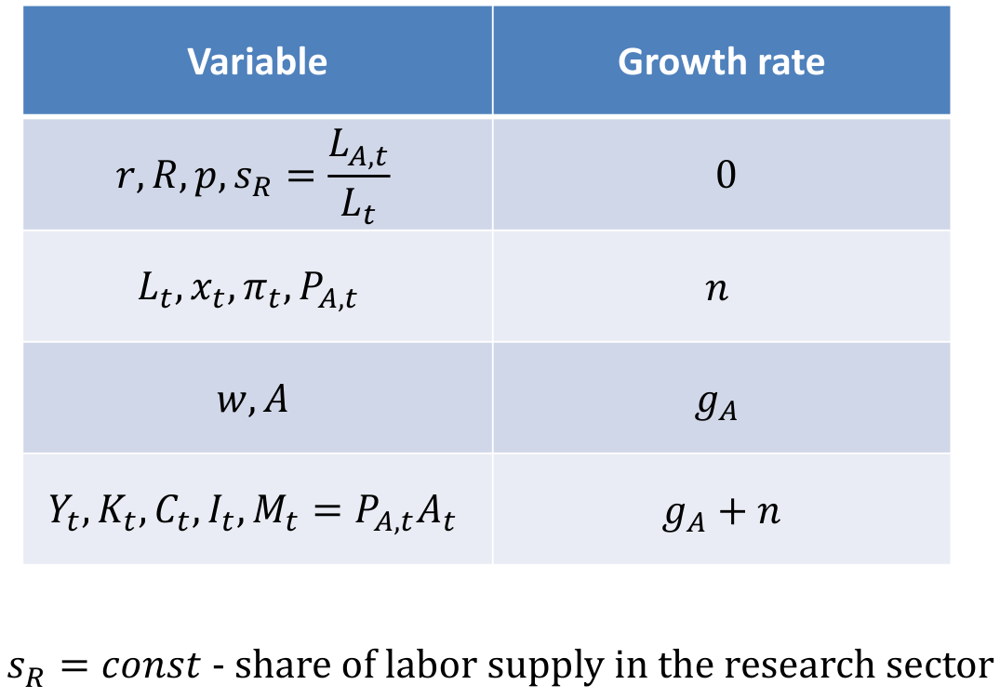{width=50%}


Derive $g_{P_A}$:
$$P_A \dot{A} = w L_A \iff  P_A \frac{\dot{A}}{A} = \frac{w L_A}{A} \iff g_{P_A} + 0 = g_w + n - g_A \iff g_{P_A} = n$$


Derive $g_{V}$:
$$V = P_A A + K \underbrace{\iff}_{\text{dont forget this!!}} g_V = g_{P_A} + g_A = g_K \Rightarrow g_V = g_A + n$$

## Planner's Problem

### "Planner's Problem"

* States: $A, K$
* Controls: $C, L_A, L_Y$
* TVC: each state has its own TVC!

Assume $z_t = \eta$ (no externalities), use CRRA utility, $\theta > 0$:

$$\max_{C, L_A} \int_0^\infty e^{-\rho t} \frac{1}{1-\theta} L_t \bigg(\bigg[\frac{C_t}{L_t}\bigg]^{1-\theta} - 1\bigg) dt $$
subject to
$$\dot{K} = K^\alpha(A (L - L_A))^{1-\alpha} - C_t - d K_t$$
and
$$\dot{A} = zL_A$$

with $K_0>0, A_0>0$, given and transversality conditions:
$$\lim_{t\rightarrow \infty}\mu_{K,t}K_t = 0 \text{ and } \lim_{t\rightarrow \infty}\mu_{A,t}A_t = 0$$

Hamiltonian and FOCs are standard. They give:

1. Standard Euler: $\frac{\dot{C}_t}{C_t} = \frac{1}{\theta}(r_t^* - \rho + \theta n)$
2. Social value of an idea = $P_A^* = \frac{\mu_A}{\mu_K}$ (marginal effect of additional $A$ on lifetime wealth
3. Planner's wage: $w^* = MPL_Y  = z \frac{\mu_A}{\mu_K} = zP_A^*$
    a. This implies: $\frac{z}{w}P_A^* = 1$
4. Planner's interest rate: $r^* = -\frac{\dot{\mu}_K}{\mu_K}$ as in Ramsey, but $r^*$ is no longer the market interest rate--rather the planner's interest rate (although, turns out they are the same)!
5. $\frac{\dot{\mu}_A}{\mu_A} = -\frac{z}{w} \frac{\partial Y}{\partial A}$ which (I think) helps only if you need to answer social value of idea questions...


**Derive LOM for $P_A$:**

1. Start with the fact that $\frac{\dot{P}_A}{P_A} = \frac{\dot{\mu}_A}{\mu_A} - \frac{\dot{\mu}_K}{\mu_K}$

$$\dot{P}_A^* = r_t P_A^* - \underbrace{\frac{z}{w}P_A^*}_{=1} \frac{\partial Y}{\partial A} = r_t P_A^* - \frac{\partial Y}{\partial A}$$


## Planner and market equilibrium comparison


### "EG Planner and Market Comparison"

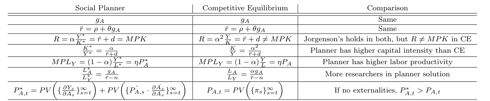

If no externalities:

* $L_A^* > L_A \Rightarrow$ 
    * $L_Y* < L_Y$
    * $A^*>A$
* $w^* = zP_A^* > w$ (despite this, the planner still underpays researchers relative to their full value??)
* $x^* > x \iff \frac{K^*}{A^*} > \frac{K}{A}$ doesn't directly imply $K^* > K$, but still true...
* $\frac{Y^*}{A^*} > \frac{Y}{A}$

With externalities, all bets are off (e.g., a negative externality will induce the planner to choose a smaller $L_A^*$).


> $g_A^* = g_A$ even though levels are different ($A^*>A$)


### "Value of ideas"

Two distortions that affect the market price of an idea relative to its social value: 

1. monopoly and 
2. externality in the research sector

$$P_A = PV(\{\pi_t\})$$
$$P_A^* = \frac{\mu_{A}}{\mu_K} = \underbrace{PV(\{\frac{\partial Y}{\partial A}\})}_{\text{Mkt value of future output}} + \underbrace{PV(\{ P_A^* * \frac{\partial \dot{A}}{\partial A}\})}_{\text{social value of future ideas (0 if no externalities)}}$$
If no externalities:
$$\frac{\partial Y}{\partial A} = (1-\alpha)\frac{Y}{A} > \alpha(1-\alpha)\frac{Y}{A} = \pi \Rightarrow  P_A^* = \frac{1}{\alpha} P_A \Rightarrow P_A^* > P_A$$
If externalities exist, we could have the opposite since the LOM for $P_A^*$ has an extra term (which depends on externalities) measuring the impact of $A$ on $\dot{A}$:

$$\text{Social value of idea} = \text{PV added future final output} + \underbrace{\text{Social value added research output}}_{\lessgtr 0}$$
With externalities:
$$MPL_A^* \neq w_* = MPL_Y$$

> Careful: $MPL_A$ doesn't really exist I don't think... must use the fact that $P_A\dot{A} = wL_A \iff w = \frac{P_A\dot{A}}{L_A}$


### "Private and social marginal benefits from research"
Private marginal benefit: 
$$w_A = P_Az$$

Social marginal benefit: 
$$MPL_A^* = \underbrace{P_A^* z}_{\text{direct}} +  \underbrace{P_A^* L_A \overbrace{\frac{\partial z}{\partial L_A}}^{\text{idea TFP}}}_{\text{indirect gain/loss in A from }L_A}$$ 


Marginal social product of an idea: 
$$MPA^* = \underbrace{\frac{\partial Y}{\partial A}}_{\text{social dividend}} + \underbrace{P_A^*\frac{\partial \dot{A}}{\partial A}}_{\text{gain/loss from knowledge externality}}$$

* Market value of idea: $\frac{\pi_t}{r - n} = \frac{\alpha (1-\alpha)Y/A}{r - n}$
* Social value of idea: $\frac{\alpha (1-\alpha)Y/A}{r - n - \underline{\varphi g_A}}$ (can be bigger or smaller than mkt value depending on sign of $\varphi$)


### "Consequences of monopoly"
Monopolists choose an output level below that of a competitive market and charge a markup. Consequences:

1. IP priced below its social value: $P_A = \alpha P_A^*$ (if no externalities - otherwise this may not hold!!).
2. Capital income rate is lower than $MPK^*$, incentives to save are weakened, which lowers long-run labor productivity: $y = \alpha y^*$


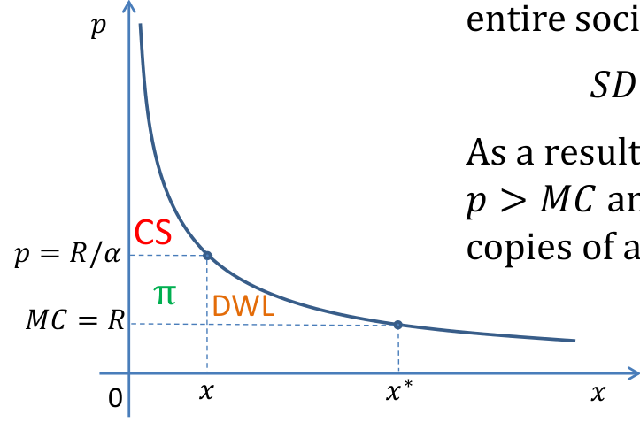


\newpage
# Misc

### "Common Tricks"
* $gn$ small and along BGP $g_Y$ is known: 
    * $(1+n)(1+g) = 1 + g + n + gn \approx 1 + g_Y$ (used in OLG, maybe elsewhere)


### "BGP"
On the balanced growth path, all components of expenditure have to grow at the same rate as $Y$. Specifically: $g_Y = g_K = g_I = g_C$. Usually $g_Y = g_A + n$.

### Def "Euler equation"
An Euler equation relates choice in one period to choice in another period.


## Prereqs


### "Combining stocks vs flows"

* Not valid: $stock + flow$
* Valid: $stock + flow * \Delta t$ or $\frac{stock}{\Delta t} + flow$

> In OLG model with a single period we don't see $\Delta t$ because it's equal to 1, but it's still there.

This is a "gotcha" mostly only in discrete time because in continuous time the dot notation usually makes it clear.


<!-- ```{r} -->
<!-- gsub(.pdf, , list.files(ECON 605 - Macro I/Notes/Slides/)) -->
<!-- ``` -->

### Def "rate of change over time interval"
$$\frac{X_t - X_{t-1}}{\Delta t}$$

### Def "Annual growth rate"
$$g_{X,t} = \frac{X_t - X_{t-1}}{X_{t-1}}$$


### Relate growth rates to rates of change
The growth rate is approximately equal to the logged rate of change:
$$g_{X,t} = \frac{X_t - X_{t-1}}{X_{t-1}} \approx \ln(X_t) - \ln(X_{t-1})$$

> unlike the rate of change, growth rate does not depend on units of measurement


### Def "Average (annual) growth rate"

<!-- 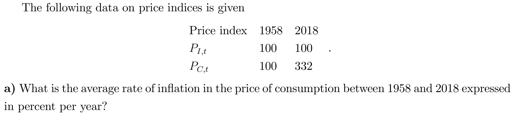 -->

<!-- 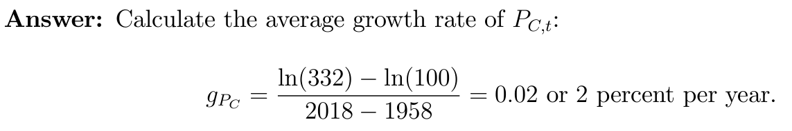 -->

<!-- CAUTION: don't just do: $\frac{332 - 100}{100} = 2.23\%$! -->

Between any two dates, $a, b$:

$$g_X = \frac{\ln(X_b) - \ln(X_a)}{b-a}$$


### Def "Annualized and instantaneous growth rate"
$$g_{X,t}  = \frac{\text{Rate of change over time interval}}{\text{Initial value of } X} = \frac{(X_t - X_{t-\Delta t}) / \Delta t}{X_{t-\Delta t}}$$

Taking $\lim_{\Delta t \rightarrow 0}$ gives the instantaneous growth rate:
$$g_{X,t} = \frac{1}{X_t}\frac{dX_t}{dt} = \frac{\dot{X}_t}{X_t}$$


### "Arithmetic with growth rates"
* $g_{XY} = g_X + g_Y$
* $g_{X/Y} = g_X - g_Y$
* $g_{X^\alpha} = \alpha g_X$


### "MPK"
$$MPK \equiv \frac{\partial Y}{\partial K} \neq \frac{\partial F}{\partial K} \text{  (e.g., if } Y = Z F(K, L))$$

<!-- ### "AMC implies GMC" -->
<!-- In each of the (standard) models in this class we have that Asset Market Clearing $\Rightarrow$ Goods Market Clearing. -->


### "Movement of variables"

* $k, w$ nearly always move together
* $k, r$ nearly always move opposite
