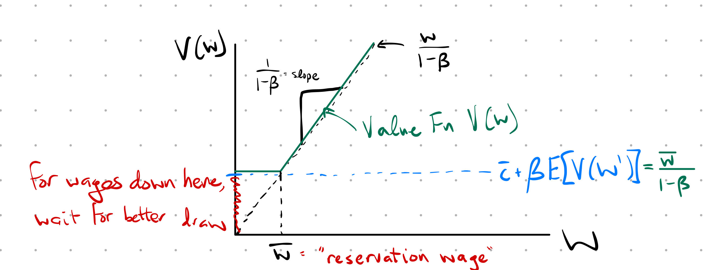
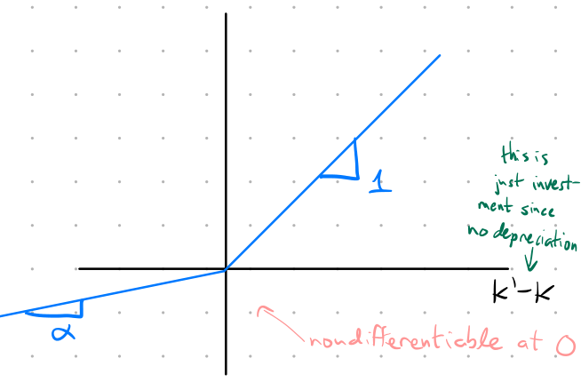
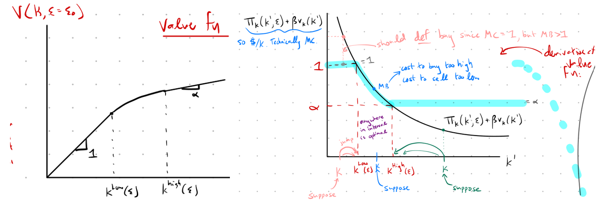
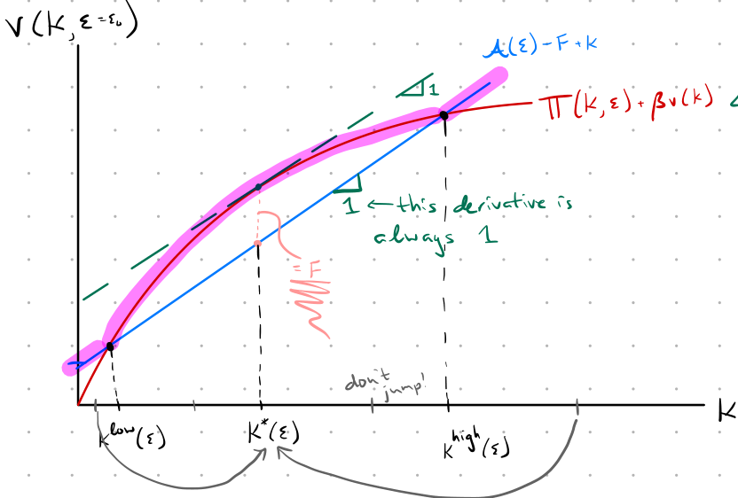
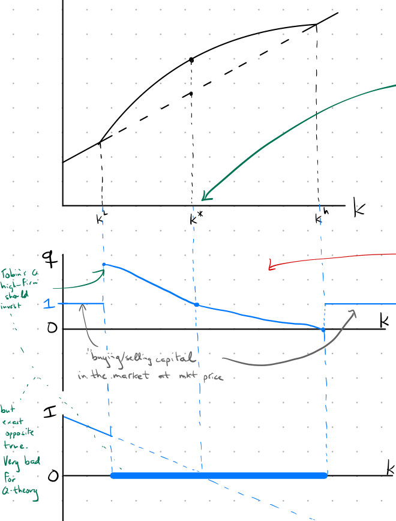

<!-- knit: (function(inputFile, encoding) { -->
<!--   rmarkdown::render(inputFile, encoding = encoding, output_dir = "../../website/parker-howell.github.io/docs/notes")}) -->


```{r, echo=FALSE}

knitr::opts_chunk$set(echo = FALSE)

colorize <- function(x, color) {
  if (knitr::is_latex_output()) {
    sprintf("\\textcolor{%s}{%s}", color, x)
  } else if (knitr::is_html_output()) {
    sprintf("<span style='color: %s;'>%s</span>", color,
      x)
  } else x
}
```


\newpage
# Simple Endowment Economy


### "Simple Endowment Economy Algorithm"

**Get Interest Rate**

1. Write Lagrangian
2. FOCs wrt $c_t,b_t,b_T$
3. Get Euler Equation, put $\frac{c_{t+1}}{c_t}$ on one side.
4. Notice that since you know $\frac{y_{t+1}}{y_t}$ and you should know $\frac{c_{t+1}}{c_t}$ (so long as everything is consumed)
    i. Of course, $\frac{c_{t+1}}{c_t}$ will oscillate if endowments aren't constant, so you'll need to break into cases (e.g., odd/even)
5. plug known value for $\frac{c_{t+1}}{c_t}$ into EE, solve for $1+r$ (in terms of $\beta$) for each case.


**Compute the equilibrium allocation**

1. Derive intertemporal budget constraint (usually same for all types, but don't forget to label)
      i. Memorize standard intertemporal budget constraint: $\sum_{t=0}^T \frac{y_t^j}{\Pi_{s=0}^{t-1}(1+r_s)} = \sum_{t=0}^T \frac{c_t^j}{\Pi_{s=0}^{t-1}(1+r_s)}$
2. Rewrite intertemporal budget constraint in terms of sums of geometric series 
    i. remember: $s_n = \frac{a_1(1-r^n)}{1-r}$
    ii. Expand summations and/or simplify each side of intertemporal budget constraint separately
        a. Use red to label periods above each term
    iii. $T$ odd or even matters. write out $T-1$ and $T$ cases.
3. Plug in values computed for $1+r$ for first case.
4. Plug even Euler Equation INTO intertemporal budget constraint
5. Rearrange to solve
6. Use EE to solve for the odd period
7. Use goods market clearing to solve for other types


> CAUTION: don't forget that $\sum_{t=0}^T \beta^t$ has $T+1$ elements in it! So, $\sum_{t=0}^T \beta^t = \frac{1-\beta^{T+1}}{1-\beta}$

> Caution: $1+\beta^2 + \beta^4 + \cdot \cdot \cdot + \beta^{T-1} = \frac{1-\beta^{2 \frac{T+1}{2}}}{1-\beta^2}$!


**Helpful to have memorized**

1. model with constant endowment growth: $r_e = r_o = \frac{1}{\beta} \Rightarrow c^A = \frac{1}{1+\beta}; c^B = \frac{\beta}{1+\beta}$
2. oscillating interest rates: $1+ r_e =\frac{1}{\beta}\frac{N^B}{N^A}; 1+ r_o =\frac{1}{\beta}\frac{N^A}{N^B} \Rightarrow \{c_e^A, c_e^B, c_o^A, c_o^B\} = \{\frac{1}{1+\beta}, \frac{N^B}{N^A}\frac{1}{1+\beta}, \frac{N^A}{N^B}\frac{\beta}{1+\beta}, \frac{\beta}{1+\beta}\}$
3. Usually: if $A$ gets endowment in even period then $r_e$ will have $N^B$ in numerator (i.e., numerator mismatches the period of the interest rate)


### "SEE Interest Rates when there is no trade"
If trade doesn't occur (e.g., everyone gets the same and wants the same) equilibrium interest rates must still be such that no parties want to trade.


### Def "Primitives Simple Endowment Economy"
* Last for $T+1$ periods, $T$ is odd
* One good, perishable (i.e., no storage)
* Two types of consumers: $A, B$, of which there are $N^A$ and $N^B$
* Endowments: $A: \{1,0,1, ..., 0\}, B: \{0, 1, 0, ..., 1\}$
* Utility: $\sum_{t=0}^\infty \beta^t u(c_t^j)$ (usually log utility)


### Def "real savings"
$$b_{t}^{j} = \frac{s_{t}^{j}}{p_{t}}$$


### Def "real rate of return (aka Fisher Equation)"
$$1+ r_t = (1+i_t)\frac{p_t}{p_{t+1}}$$
Can also write
$$1+ r_t = \frac{1+i_t}{1+\pi_t} \Rightarrow \underbrace{r_t \approx i_t - \pi_{t+1}}_{\substack{\text{by logs:} \\ \text{approx in discrete} \\ \text{exact in cont time}}}$$


### Def "SEE Budget constraints"
* period 0: $\underbrace{ p_0 y_0^j}_{\text{sell all}} \geq \underbrace{p_0 c_0^j}_{\text{buy some back}} + \underbrace{s_0^j}_{\text{save rest}}$
* period t: $p_t y_t^j + s_{t-1}(\underbrace{1 + i_{t-1}}_{\substack{\text{1+net = } \\ \text{gross nom}}}) \geq p_t c_t^j + s_t^j$
* period T: $p_T y_T^j + s_{T-1}(1 + i_{T-1}) \geq p_T c_T^j + \underbrace{s_T^j}_{\text{need no Ponzi}}$
* No Ponzi: $s_T^j \geq 0$
* rewrite period $t$ to convert from nominal: $y_t^j + \frac{s_{t-1}}{p_t}(1 + i_{t-1}) \geq c_t^j + \frac{s_t^j}{p_t}$
* rewrite period $t$ in terms of real savings: $y_t^j + \underbrace{\frac{s_{t-1}}{p_{t-1}}}_{b_{t-1}} \frac{p_{t-1}}{p_t} (1 + i_{t-1}) \geq c_t^j + \underbrace{\frac{s_t^j}{p_t}}_{b_t}$
* Final version of budget constraint:
$$y_t^j + b_{t-1}^j(1+r_{t-1}) \geq c_t^j + b_t^j$$
or, for period 0:
$$y_0^j \geq c_0^j + b_0^j$$


**Intertemporal Budget Constraint:**

* Write out first few periods
* Recursive substitution:
    * rearrange period 1 in terms of $b_0$
    * Plug this into period 0 constraint
    * iterate
    * Notice that $b_T = 0$ by TVC
* Simplify into summation notation
    * Don't forget to have the product of interest rates go up to only $t-1$

E.g., start with 
$$y_0 = c_0 + b_0$$
Rearrange the $t=1$ constraint:
$$y_1 + b_0(1+r_0) = c_1 + b_1 \iff b_0 = \frac{1}{1+r_0}(c_1 -y_1 + b_1)$$
Plugging in for $b_0$ gives:
$$y_0 = c_0 + \frac{1}{1+r_0}(c_1 -y_1 + b_1)$$
Repeat for $t=2$:
$$y_2 + b_1(1+r_1) = c_2 + b_2 \iff b_1 = \frac{1}{1+r_1}(c_2 -y_2 + b_2)$$
Plug in again:
$$y_0 = c_0 + \frac{1}{1+r_0}(c_1 -y_1 + \frac{1}{1+r_1}(c_2 -y_2 + b_2))$$
Keep plugging in until $t=T$:
$$y_0 = c_0 + \frac{1}{1+r_0}(c_1 -y_1) + \frac{1}{1+r_0}\frac{1}{1+r_1}(c_2 -y_2) + \cdot \cdot \cdot + \frac{1}{1+r_0}\times\cdot\cdot\cdot\times\frac{1}{1+r_T}(c_T + y_T + \underbrace{b_T}_{=0})$$
Gives:
$$\sum_{t=0}^T \frac{y_t^j}{\Pi_{s=0}^{t-1}(1+r_s)} = \sum_{t=0}^T \frac{c_t^j}{\Pi_{s=0}^{t-1}(1+r_s)}$$


### "SEE Market Clearing"
* goods market: Total consumption = Total endowment 
    * e.g., $N^A c_t^A + N^B c_t^B = N^A y_t^A + N^B y_t^B$
* money/bond market: Total Saving and Borrowing = 0
    * e.g., $N^A b_t^A + N^B b_t^B = 0$


### Def "Competitive equilibrium"
A *competitive equilibrium* consists of

* prices $\{1+r_t\}_{t=0}^{T-1}$ and 
* sequences of allocations $\{ c_t^A, c_t^B, b_t^A, b_t^B  \}_{t=0}^{T}$ such that

1. Taking prices as given, the sequences of allocations maximize utility for $j = A,B$, and
2. All markets clear:

* goods market: $N^A c_t^A + N^B c_t^B = N^A y_t^A + N^B y_t^B$
* money/bond market: $N^A b_t^A + N^B b_t^B = 0$


### "SEE Standard UMax"
$$\max \sum_{t=0}^\infty \beta^j \ln c_t^j$$
s. to

* No Ponzi: $b_T \geq 0$ (this is transversality condition)
* $y_t^j + b_{t-1}(1+r_{t-1}) \geq c_t^j + b_t^j$

Gives:

$$\mathcal{L} = \sum_{t=0}^\infty \beta^t \ln c_t +  \sum_{t=0}^\infty \lambda_t (y_t + b_{t-1}(1+r_{t-1}) - c_t - b_t) + \mu_T b_T$$
Note:
$$\partial b_T: \lambda_T = \mu_T$$
And we know $\lambda_T$ = MU of consumption is strictly positive. So, we must have that $b_T = 0$.


### Def "standard Euler Equation"
$$c_{t+1} = \beta (1+r_t)c_t$$

> Remember: this EE corresponds to a single person

\newpage
# Dynamic Programming


### "Dynamic Programming Algorithm"

0. Rewrite control $c$ in terms of tomorrow's state $k'$.
    a. $c = k^{\alpha} - k'$
1. Write Bellman
    a. $V(k) = \max_{k'} \{\ln(k^\alpha - k') +  \beta V(k') \}$
2. Take FOC of Bellman wrt $k'$.
    a. $V_{k'}(k) = 0 \iff \frac{-1}{k^\alpha - k'} + \beta V_{k'}(k') = 0$
    b. At this point, the only unknown piece is $V_{k'}(k')$. We can't solve for it directly yet, so first: 
3. Differentiate Bellman again, but now wrt $k$. Envelope thm ensures second term is 0.
    a. $V_k(k) = \frac{\alpha k^{\alpha - 1}}{k^\alpha - k'} + \underbrace{\beta V_k(k')}_{=0}$
4. Iterate to get $V_{k'}(k')$
    a. $V_{k'}(k') = \frac{\alpha k^{'\alpha - 1}}{k^{'\alpha} - k''} = \frac{\alpha k^{'\alpha - 1}}{c'}$
6. Plug into FOC
    a. $\frac{-1}{c} + \beta  \frac{\alpha k^{'\alpha - 1}}{c'}= 0$
7. Rearrange
    a. $\frac{1}{c} = \beta  \frac{\alpha k^{'\alpha - 1}}{c'}$


### Thm "Theorem of the Maximum"
If $u(x, s)$ is continuous then $v(s) = \max_x \{u(x,s)\}$ is continuous, and $h(s) = arg \max_x \{u(x,s)\}$ is upper hemicontinuous

**Additionally:** If $u(x, s)$ is strictly concave in $x$ for any $s$, then $h(s)$ is single-valued and continuous.

> Recall: upper hemicontinuity is what says convergent sequence converges in the set


### Def "Bellman"

The value of being in state $s_0$ is:
$$V(s_0)=\max_{\{c_t, s_{t+1} \}_{t=0}^\infty} \sum_{t=0}^\infty \beta^t u(c_t, s_t) \text{ s. to } \underbrace{s_{t+1} = g(c_t, s_t)}_{\text{transition eq}} \text{ and } s_0 \text{ given.}$$
where $c = $ choice variable(s), $s = $ state variable(s).

$V(\cdot)$ satisfies the "principle of optimality" (I'm going to pick everything I possibly can to try to maximize given that I am now in $s_0$).


Bellman:
$$V(s_0)=\max_{c} \{ u(c,s) + \beta V(s') \}$$


### Def "Contraction Mapping"
Define the mapping $T: X \rightarrow X$ where
$$T(f(s)) \equiv \max_c \{ u(c,s) + \beta f(g(c,s))  \}.$$

$T$ is a *contraction mapping* with modulus $\lambda\in (0,1)$ if $\forall x, y\in X$:
$$d(T(x), T(y)) \leq d(x, y).$$
For us, $x, y$ are functions and the metric norm we use is the supnorm: $d(x, y) = \sup_{s\in S} |x(s) - y(s)|$.


### Thm "Contraction Mapping Thm"

If $X$ is *complete* metric space and $T: X \rightarrow X$ is a contraction (with $\lambda$), then

1. $T$ has a *unique* fixed point: $x^* = T(x^*)$
2. for all $x_0 \in X$: $d(T^n(x_0), x^*) \leq \lambda^n d(x_0, x^*)$ for all $n = 0, 1, 2...$ where $T^n(x_0) = T(T^{n-1}(x_0))$


> Complete: "Cauchy sequences converge to a point in the space"

> In words: If the metric space is complete and $T$ is a contraction mapping then $T$ has exactly one fixed point which guarantees the uniqueness and existence of a solution.


### Thm "Blackwell's Sufficient Conditions for a Contraction"
Let $X(s)$ be the set of bounded functions on $S \subseteq \mathbb{R}^m$.

Let $T: X(s) \rightarrow X(s)$ satisfy

1. monotonicity: $x, y \in X: x \geq y \Rightarrow T(x) \geq T(y)$
2. discounting: Let $k \in X(s)$ be a constant function. Then $x\in X(s) \Rightarrow T(x+k) \leq T(x) + \beta k$, for some $\beta \in (0,1)$.

Then, $T$ is a contraction.

> Caution: this monotonicity is different from the monotonicity of the value function

### "What should you know about math of dynamic programming?"

1. Our functional equation exists and has a unique solution.
2. $V$ is strictly concave if $u(c, s)$ is strictly concave
3. $V$ is approached by iterations: $v_{j+1}(s) = \max_c \{ u(c,s) + \beta v_j(g(c, s)) \}$
4. In the interior of $s$, $V$ is often differentiable.


### "Value Function Properties"
1. Continuity
2. Monotonicity (not the same as the monotonicity of Blackwell's)
    a. this is: "is the value function itself monotone"
    b. remember: we don't need strict increasing (think about the reservation wage in search model--flat is fine)
3. Differentiability (usually assume concavity to prove differentiability)


### "To have a unique solution to the Bellman"
1. Generate a $T$-mapping from our value function
    a. literally just replace $V$ with $Tf$: go from $v(x, z) = \sup_{x' \in \Gamma(x, z)} \{F(x, x', z) +  \beta E[v(x', z')]\}$ to $Tf(x, z) = \sup_{x' \in \Gamma(x, z)} \{F(x, x', z) +  \beta E[Tf(x', z')]\}$
2. Check that the value function is bounded
3. Assume the value function is continuous and weakly increasing
4. Check monotonicity and discounting
5. If both hold, invoke Blackwells to show that $T$ is a contraction mapping
6. If $T$ is a contraction mapping then it will converge (under the supnorm) to a unique fixed point $v$ by the Contraction Mapping Theorem.


<!-- ### "Benveniste-Sheinkman (Pancake Thm)" -->


\newpage
# Consumption

## PIH

### Def "PIH"
Think of income as $y_t = y_t^{Permanent} + y_t^{Transitory}$. 

PIH says consumption is a function of $y_t^{Permanent}$ only.

Think of $y_t^{Permanent}$ as "annuity value" of lifetime income.

> MPC if you are old should be relatively high: you only have a few more years to live so an increase in income should be spent right away

> MPC if you are young should be relatively low: you have to spread an increase in income over the rest of your life

> As soon as income is promised, lifetime consumption should increase proportionally over each period.

### Model "Random Walk Hypothesis (Hall 1978)"
We have stochastic Euler:
$$u'(c_t) = \beta(1+r)E_t[u'(c_{t+1})].$$
Hall looks at the Euler equation and realizes: $E_t[u'(c_{t+1})]$ is NOT actual marginal utility of next period, it's really $u'(c_{t+1}) +  \varepsilon_{t+1}$, and the error is actually forecast error!

And, if expectations are rational, then $E_t[\varepsilon_{t+1}] = 0$!

So, $Cov_t(u'(c_t), \varepsilon_{t+1})=0$! In fact, $Cov_t(x_t, \varepsilon_{t+1})=0$ for any date-$t$ information, $x_t$. Plug this into the Euler equation to see that
$$u'(c_{t+1}) = \frac{1}{\beta (1+r)} u'(c_t) + \varepsilon_{t+1}.$$

In other words, the marginal utility of consumption is following a random walk with drift! (Where drift=$\frac{1}{\beta(1+r)}$).

> this may suggest that consumption inequality is growing without bound.


### Paper "Hansen + Singleton 1982"
Have $i = 1, ..., N$ assets. Still a 1-good model, just have lots of assets now.

Budget constraint:
$$c_t + \sum_{i=1}^N p_{i,t} a_{i,t} + s_t = y_t + s_{t-1}(1+r_{t-1}) + \sum_{i=1}^N a_{i, t-1} (p_{i,t} + d_{i,t})$$


* $a_i =$ number of units of asset $i$
* $d_i =$ dividend of asset i, received in the morning
* $p_i =$ price of asset i

Euler Equation:
$$p_{i, t} u'(c_t) = \beta E_t[(p_{i, t+1} + d_{i, t+1}) u'(c_{t+1})], \forall i.$$
Define ex-post real rate of return $R_{i, t+1} \equiv \frac{p_{i,t+1} + d_{i,t+1}}{p_{i,t}}$. Rewrite EE as
$$\beta E_t \bigg[\frac{u'(c_{t+1})}{u'(c_t)} R_{i, t+1}\bigg] = 1.$$
Define the ex-post difference between the forecast and actual:
$$\varepsilon_{i, t+1}(\theta) = \beta E_t \bigg[\frac{u'(c_{t+1})}{u'(c_t)} R_{i, t+1}\bigg] - 1$$
where $\theta$ is a set of parameters we will estimate using structural estimation. Impose functional form $u(c) = \frac{c^{1-1/\sigma}}{1-1/\sigma}$ to get:
$$\varepsilon_{i, t+1}(\theta) = \beta \bigg(\frac{c_{t+1}}{c_t}\bigg)^{-1/\sigma}R_{i, t+1} - 1.$$
We have data on $R$ and $c$, so $\theta = [\beta, \sigma]$.

Then we'll iterate through different values of $\beta, \sigma$ to get $E_t[\varepsilon_{i, t+1}(\theta)]$ to be close to 0.

Imposing rational expectations means that
$$E_t[\varepsilon_{i, t+1}(\theta) z_t] = 0, \forall i \forall z, \text{ where z is any var. dated t or earlier}.$$

They use GMM to get estimates: $\beta \in [.942, .998], \sigma \in [.67, .97]$.


### "Rational expectations"
Imposing rational expectations means that
$$E_t[\varepsilon_{i, t+1}(\theta) z_t] = 0, \forall i \forall z, \text{ where z is any var. dated t or earlier}.$$


### Def "Variations on PIH"

1. Precautionary Savings
2. Borrowing Constraints
3. "Irrational" Intertemporal Choice

## 1. Precautionary Savings


### Model "Precautionary Savings"

Assume $1+r = \frac{1}{\beta}$. Start with Euler Equation:

$$u'(c_t) = E_t[u'(c_{t+1})]$$

2nd order Taylor Approximate at $c_t$ to get:

$${ u'(c_t)} \approx E_t[u'(c_t) + u''(c_t)(c_{t+1} - c_t) + \frac{u'''(c_t)}{2!}(c_{t+1} - c_t)^2]$$
Note: you can pull anything dated $t$ or earlier out of expectation. Cancel, rearrange, divide by $c_t$ to get
$$E\bigg[\frac{c_{t+1} - c_t}{c_t}\bigg] \approx \underbrace{\bigg(-\frac{1}{2}\bigg)}_{<0}  \underbrace{\bigg(\frac{u'''(c_t)}{u''(c_t)}c_t\bigg)}_{\lessgtr0} \underbrace{\bigg(E_t\bigg[\bigg(\frac{c_{t+1} - c_t}{c_t}\bigg) ^2\bigg]\bigg)}_{>0}$$
*Takeaway*: Hall's random walk holds for all first-order approximations if all you care about is slope (i.e., elasticity), but when you look at the second order Taylor approximation of any utility function with if $u'''(c_t) > 0$ you see that individuals save more (precautionary savings) under uncertainty!


> Kimball (1980) calls $-\frac{1}{2}(\frac{u'''(c_t)}{u''(c_t)}c_t)$ the coefficient of relative prudence.

> Precautionary savings is very different from risk aversion: $u"'$ tells me how
my behavior changes in the face of risk. Risk aversion deals with $u''(c)$, and doesn't actually affect behavior.

Relevant Lit:

1. Kimball (1980)


## 2. Borrowing Constraints (aka intro to Huggett)

### "Borrowing Constraints"

* $A' \geq -\phi$ (limit to how negative $A'$ can go)

So, at $A' = -\phi$ you are at the constraint and would like to borrom more (MU of consumption today is high) but you can't.

Hall says $u'(c_t) \neq E[u'(c_{t+1})]$  (i.e., Random Walk).

This says: $u'(c)$ is a nonnegative supermartingale.


Relevant Lit:

1. Huggett

### Def "primitives of Stochastic Exchange Economy"
* $A' \geq -\phi$
* $A' = h(y, A)$ is the optimal policy function - we get $A'$ from individual $i$'s dynamic programming function.
* $r$ is constant (we assume this to simplify bc too hard otherwise)
* endowments
* no storage
* mass 1 of consumers
* $y_t(i) \sim \varphi[y^{min}, y^{max}]$ (this is a pdf or pmf that characterizes endowments. Importantly: endowments not correlated across individuals)

**Claim:** 

$$Y_t = \int_0^1 y_t(i) di = \bar{y} \text{ (mean of the aggregate endowment)}, \forall t$$


### Def "stationary stochastic equilibrium (Huggett)"
A *stationary stochastic equilibrium* consists of 

* a (single) interest rate $(1+r)$,
* a policy function $h(y,A)$, and 
* a distribution $g(A)$, 

such that

1. $h(\cdot)$ is optimal given $1+r$,
2. All markets clear:
    1. bond market $\int_{-\infty}^\infty \int_{y^{min}}^{y^{max}} h(y,A) \varphi(y)g(A) dy dA = 0$ (i.e., agg savings  0)
    2. goods market - clears by Walras' law
3. $g(A)$ is implied by $h(\cdot)$.


> individuals may move around, but the distribution itself is stationary


## 3. "Irrational" Intertemporal Choice

### Model "Irrational Intertemporal Choice"
Let individual agents change preferences--essentially playing games against their past and future selves, finding Nash equilibria.

Relevant Lit:

1. Laibson
2. Caplin + Leahy


### Laibson (1997) "Commitment devices"
IRL people use commitment devices (e.g., tax withholding, destroying credit cards). This is indicative of self-control problems. But, the representative consumer doesn't use these commitment devices. In fact, the representative consumer has credit card debt. Something about converting savings to illiquid assets.

* Standard discounting: $u = u(c_0) + \beta u(c_1) + \beta^2 u(c_2) + \cdot \cdot \cdot$
* Quasi-hyperbolic discounting: $u = u(c_0) +  \delta \{\beta u(c_1) + \beta^2 u(c_2) + \cdot \cdot \cdot\}$

> Ainsle (1992) says $\delta = 2/3$ (very high!)

**Compare $t+k$ vs $t+k+1$:**

**At time $t$:**
$$MRS = \frac{\delta \beta^{t+k} u(c_{t+k})}{\delta \beta^{t+k+1} u(c_{t+k+1})} = \frac{u'(c_{t+k})}{\beta u(c_{t+k+1})}$$
**At time $t+k$:** 
$$MRS = \frac{\beta^{t+k} u(c_{t+k})}{\delta \beta^{t+k+1} u(c_{t+k+1})} = \frac{u'(c_{t+k})}{\delta\beta u(c_{t+k+1})}$$


### Caplin + Leahy (2004, JPE) "Valuation of Past Consumption"
The only way to go through life without constantly regretting decisions is to 'upgrade' past experiences. E.g., "we're not forgoing income during PhD in hopes of getting a reward later; we're just still celebrating the candy bar we ate as a child."

{width=50%}

If we really are different people at different stages of life, the conclusion is: young guy is screwing over old guy--we should save more at time $t$.

> Playing games against different versions of one's self


\newpage
# Labor Supply and Search


## Supply

<!-- Sargent + Ljungvist 6.1-6.3 -->

### Def "Labor Supply Setup"

Neoclassical (price-taking, utility maximizing, single time period framework) Labor Supply: $\max \{u(c) - \nu(N)\}$

e.g., 
$$\max_{c,N} \bigg\{\frac{c^{1-\frac{1}{\sigma}}}{1-\frac{1}{\sigma}} - \phi \frac{N^{1+ \frac{1}{\eta}}}{1+ \frac{1}{\eta}} \bigg\} \text{ s. to } pc = wN+A$$

where $N$ = number hours worked, $A$ = other assets, $\eta > 0$ is Frisch Labor Supply Elasticity.

FOC:

$$v'(N) = \frac{w}{p} u'(c) \Rightarrow \text{ using parametric form: } \phi N^{1/\eta} = \frac{w}{p} c^{-1/\sigma}$$
Taking logs:
$$\ln N = \eta \ln \frac{w}{p} - \frac{\eta}{\sigma} \ln c - \eta \ln \phi$$
This lends itself to a common regression. Applied economists often "tack on" an additional error term to account for structural things, omitted variables, or measurement bias.

This implies that leisure is a normal good. We see an income effect on labor supply.


## Search

### "McCall Search Model"

* unemployed worker draws $w \sim^\text{iid} F(w)$ on $[0,B]$
    * note: $w$ could include nonmonetary aspects of a job (e.g., commute, sector, etc.)
* accept: stay at job forever
* reject: get unemployment insurance, $\bar{c}$, current offer vanishes. Draw again next period

Bellman:
$$V(w) = \max_{\text{{Acc, Rej}}} \bigg(\frac{w}{1-\beta}, \bar{c} +  \beta E[V(w')]   \bigg)$$
where $E[V(w')] = \int_0^B V(w')f(w')dw' =const$ since $w$'s are iid!




Can write $V(w)$ as
$$\begin{cases} 
\frac{w}{1-\beta}; w \geq \bar{w}\\
\frac{\bar{w}}{1-\beta} = \bar{c} + \beta E[V(w')]; w \leq \bar{w}
\end{cases}$$

So, at the kink
$$\frac{\bar{w}}{1-\beta} = \bar{c} + \beta E[V(w')] = \bar{c} +  \beta \bigg[F(\bar{w}) \frac{\bar{w}}{1-\beta} + \int_{\bar{w}}^B \frac{w'}{1-\beta}f(w')dw' \bigg]$$
Multiply by $1-\beta$ and add 0:
$$\bar{w} = \bar{c}(1-\beta) +  \beta \bigg[F(\bar{w}) \bar{w} + \underbrace{\int_{\bar{w}}^B w'f(w')dw' + \int_0^{\bar{w}} w'f(w')dw'}_{\equiv \mu_w} - \int_0^{\bar{w}} w'f(w')dw' \bigg]$$
So,
$$\bar{w} = \bar{c}(1-\beta) +  \beta  \mu_w - \underbrace{\int_0^{\bar{w}} w'f(w')dw'}_{\equiv g(\bar{w})} $$


### "Search: Ensure Unique Solution"
Recall: $g(w) = \int_0^{\bar{w}} w'f(w')dw'$


Uniqueness: $g(w)$ has a slope smaller than 1, so $\bar{w}$ is always unique.

Existence: slope limits to $\beta$ so they have to intersect


### "Neal: Jobs vs careers"
New career requires a new job, but the converse not true.

* no unemployment; you quit in the morning and go straight to the new job


details omitted.


\newpage
# Asset Pricing

## CAPM

### Def "stochastic discount factor"

$$m_{t, t+j} = m_{t+j} \equiv \beta^j \frac{u'(c_{t+1})}{u'(c_t)}$$

### Def "price of asset $i$"

$$p_{i,t} = E_t \bigg[\sum_{j=1}^\infty m_{t,t+j} x_{i,t+j} \bigg] = E_t \bigg[\sum_{j=1}^\infty \beta^j \frac{u'(c_{t+1})}{u'(c_t)} x_{i,t+j}\bigg]$$

### Def "R (payoff of asset)"
$$R_{i,t+1} \equiv \frac{p_{i,t+1} + x_{i, t+1}}{p_{i,t}}$$

> period of the numerator matches the period of the return 


### Def "CAPM"

* $Cov(m, R) = 0 \Rightarrow$ risk-adjsted return = safe return
* $Cov(m, R) < 0 \Rightarrow$ when $R$ high, $m$ low (on average)
    * MU(c) is low, which means consumption is high (economy booming). So, asset pays when economy good, and asset sucks when economy sucks.
    * $E_t[R] > 1+r_t$ <-- this is risk!
* $Cov(m, R) > 0 \Rightarrow$ when $R$ high, $m$ high (on average)
    * economy sucks, but asset comes thru. willing to sacrifice rate to reduce risk


> "US steelworkers should buy stock in foreign steel"


> If you have an asset paying off when MU(c) is high, this is an asset that reduces your risk. So, you are willing to sacrifice your return to acquire the risk-reducing asset.

> "If I tell you this asset will come through in your darkest hour you will want that asset. So demand will rise $\Rightarrow$ price will rise."


### "CAPM expected return of risky versus risk-free asset"
$$E_t[R_{t+1}] = \frac{1 - Cov(R_{t+1}, m_{t, t+1})}{E_t[m_{t, t+1}]}$$
$$E_t[R_{risk-free}] = \frac{1 - 0}{E_t[m_{t, t+1}]} = \underbrace{\frac{1}{E_t[\beta\frac{u'(c_{t+1})}{u'(c_t)}]} = \frac{1}{\beta}}_{\text{w/ perfect foresight}}$$

> risk-free means that the return is independent of the relationship between $R$ and $m$


### Puzzle 1 "Log approximation suggests $r \approx 11%$"
do reading!


### Puzzle 2 "Equity Premium Puzzle"

Mehra & Prescott (1985) show that equity (risky) return over last 100 years is approx 8% compared to 1% for bonds. 

We would need an implausibly high level of risk aversion to make this 7% difference plausible. 

Potential (incomplete) solutions: Habit Formation, Myopic Loss Aversion


### "Model Lucas Asset Pricing (Trees)"

* Endowment economy
* "Trees" - identical and correlated entities (think firms) 
* Trees bear a dividend, $x_t$ each period. 
    * $x_t \sim F(x | x_{t-1})$ (Markov Process)
* No trade
* No storage
* In equilibrium $c_t = x_t$ (this is true for every agent)

FOC:
$$E_t \bigg[ \underbrace{\beta \frac{u'(c_{t+1})}{u'(c_t)}}_{\equiv m_{t, t+1}} \underbrace{\frac{p_{t+1} + x_{t+1}}{p_t}}_{\equiv R_{t+1}}   \bigg] = 1$$
So Lucas gives CAPM result:
$$E_t \bigg[ m_{t, t+1} R_{t+1}   \bigg] = 1$$


### Def "Stochastic Competitive Equilibrium"
A *Stochastic Competitive Equilibrium* is 

* a pricing function $p_t = \varphi(x_t)$ and 
* an allocation rule $sc(x_t)$ such that

1. goods market clears: $c(x_t) = x_t$ and
2. Euler equation holds: $E_t \bigg[ \beta \frac{u'(x_{t+1})}{u'(x_t)} \frac{\varphi'(x_{t+1}) + x_{t+1}}{\varphi'(x_t)}   \bigg] = 1$

> In this economy, shocks affect the aggregate economy--very different from previous equilibria in which a shock affected an  individual. Shocks to the aggregate economy will cause price changes.


\newpage
# Investment


### "Facts about US Investment"
* Investment makes up 15-20% of GDP
* $\Delta$ Inventories comprises 0.1% of GDP, but unsold inventories account for 1/3 of variation in GDP
* $\delta$ for equipment $\approx$ 7-15% per year
* $\delta$ for structures $\approx$ 1-3% per year

### Def "User Cost of Capital"
$$\underbrace{p}_{=1} MPK = p_t^k (r + \delta  - \frac{\Delta p_{t+1}^k}{p_t^k}(1-\delta))$$
or in continuous time:
$$r_K(t) = p_K(t)\bigg[r(t) + \delta - \frac{\dot{p}_K(t)}{p_K(t)}\bigg]$$

> works well for long-term rentals/purchases, but not so well for short-term.


### "Jorgenson's Model"
Firm input demand: 
$$\max \sum_{t=0}^\infty (\frac{1}{1+r})^t\bigg(\underbrace{p}_{=1} F(K_t, N_t) - w_t N_t - p^k_t I_t  \bigg) \text{ s. to } K_{t+1} = K_t(1-\delta) + I_t$$
Solving gives:
$$F_{K, t+1} = p_{t+1}^K (r + \delta  - \frac{\Delta p_{t+1}^k}{p_t^k}(1-\delta))$$
which is the user cost of capital we defined previously.

In continuous time, $1-\delta \rightarrow 1$. We solve through Hamiltonian or Dynamic Programming to get:
$$p_t^k = \frac{1}{1+r} \sum_{j=0}^\infty (\frac{1-\delta}{1+r}^j) F_{k,t+j+1}.$$

> Summers: "this isn't really even investment demand... it's just capital demand."


## Q-theory

> "Investment analog to the PIH"


### Def "Tobin's Q"
$$Q^{Tobin} = \frac{\text{Value of firm}}{\text{Replacement Cost of Capital}} = \frac{V}{K} \equiv \text{average } Q$$

* $Q>1 \Rightarrow$ should invest! (increase capital)
* $Q>1 \Rightarrow$ should disinvest! (decrease capital)


### Def "Hayashi Form"
Common parametrization for adjustment costs:
$$C(I, K) = K \phi(\frac{I}{K}), \phi \text{ convex. E.g., } C(I, K) = K \underbrace{\gamma(\frac{I}{K} - \delta)^2}_{\phi}.$$


### Steady State Investment
Steady state investment means $K$ not changing. So, from LOM:

$$\bar{K} = \bar{K}(1-\delta) + \bar{I} \iff \bar{I} = \delta \bar{K}$$


### Model "Hayashi, Abel, Summers (i.e., Jorgenson's with adjustment costs)"

$$V(0)= \int_0^\infty e^{-rt} [F(K(t)) - \underbrace{p^K}_{=1} I(t) - C(I(t), K(t))]dt \text{ s. to } \dot{K}(t) = I(t) - \delta K(t)$$
$$\mathcal{H}^{\text{current value}} = F(K) - I - C(I, K) + q(I - \delta K)$$


Note that $q=$ Marginal value of additional capital = "marginal $q$." We want an expression for $q$ 

Assume Hayashi form and take FOCs:
$$\frac{\partial \mathcal{H}}{\partial I} = 0 \iff  -1 - \frac{\partial}{\partial I} (K \phi(\frac{I}{K})) + q = 0 \iff \phi'(\frac{I}{K}) = q - 1$$
$$\frac{\partial \mathcal{H}}{\partial K} = H_K = rq - \dot{q} \iff F_K - C_K - \delta q = rq - \dot{q} \iff F_K - C_K = q(r + \delta - \frac{\dot{q}}{q})$$
Call $C_K = \phi(\frac{I}{K}) + K \phi '(\frac{I}{K})(-\frac{I}{K^2}) \equiv \Gamma(\frac{I}{K})$


In the end we get:
$$q(t) = \int_t^\infty e^{-(r+\delta)(s - t)} [F_K(s) - \Gamma(s)]ds$$


### Thm "Hayashi's Thm"
If $F(K, N)$ and $C(I, K)$ are both homogeneous of degree 1 (aka $H^1$ or CRS in all inputs) then $Q = q$.

Other assumptions Hayashi makes implicitly:

* No financing constraints
* Firms perfectly competitive
* Single type of capital


**Intuition:** value of the firm is linearly proportional to capital: $V(t) = const(t) K(t)$.

Given $K(t)$, $K(t+s), I(t+s), N(t+s)$ are optimal if $K(t)$ doubles:

* $K^{new}(t+s) = 2 K(t+s)$
* $I^{new}(t+s) = 2 I(t+s)$
* $N^{new}(t+s) = 2 N(t+s)$

> If I double $K$ I double the value of the firm


### "Intertermporal Elasticity of Investment Demand"
"Lumpy" investment/inertia

Same model as before, but we've shifted back to discrete:

$$\underbrace{q_t}_{\text{Shadow Val}} = \frac{MPK_{t+1}}{1+r} + \underbrace{\frac{1-\delta}{1+r}q_{t+1}}_{\text{continuation val}}$$

$$\underbrace{p_t^k = q_t}_{\text{no adj costs now!}} = \frac{1}{1+r} \sum_{j=0}^\infty (\frac{1-\delta}{1+r})^j MPK_{t+j+1}$$

> if I know of some improvement in future MPK I should invest more today!


### Claim "Temporary subsidies"
If the subsidy is temporary and $\delta$ (and $r$) are small then $q_{j,t} \approx \bar{q}_j$. (i.e., $\frac{\Delta q_{j,t}}{\bar{q}_j} \approx 0$).

Two reasons:

1. $\frac{\Delta K_t}{K_t} \approx 0$ if $\delta$ small
2. Temporary nature of the policy means that only a few terms of the firm's MPK are affected--most MPKs are not affected. And, since $\delta$ is low, our future considerations of the 30+ year payoff FAR outweigh any effect of the subsidy.


## Nonconvex Adjustment Costs

### "Adjustment costs useful facts + definitions"

* $I = k' - k$ since depreciation is zero
    * so, when you see $\phi(k' - k)$ that's really just $\phi(I)$

Notice that $\varepsilon$ integrates out of the continuation value. So you can define:
$$v(k') \equiv E_\varepsilon[V(k', \varepsilon')] = \int_0^\infty V(k', \varepsilon')f(\varepsilon')d\varepsilon'$$
This lets us rewrite the Bellman without the dependence on $\varepsilon'$:
$$V(k, \varepsilon) = \max_{k'} \{\Pi(k',\varepsilon) - \phi(k' - k) +  \beta v(k')\}$$


* Payoff function is very standard: 

$$\Pi(K, \varepsilon), \varepsilon \sim iid, \Pi_K > 0, \Pi_{KK} < 0, \Pi_{K, \varepsilon} > 0$$

* high $\varepsilon \Rightarrow$ MB higher = good time to be holding the capital instead of selling
    * example of $\varepsilon$: shock to oil prices, cost of input goods, etc.


### "Model: Investment with Kinked Adjustment Costs"

* purchase capital at $p^k$ (generally normalized to 1)
* sell capital at $\alpha p^k, \alpha < 1$
* assume no depreciation and can use capital the same day you buy it
* Cost of buying capital: 
$$\phi(K' - K) = \begin{cases} K' - K \text{ if } K' \geq K \\ \alpha(K' - K) \text{ if } K' \leq K \end{cases}$$
{width=50%}


*Algorithm to Solve with Kinked Adjustment Costs:*

0. Write Bellman
    i. $V(k, \varepsilon) = \max_{k'} \{\Pi(k',\varepsilon) - \phi(k' - k) +  \beta E_{\varepsilon'}[V(k',\varepsilon')]\}$
    i. Rewrite using small $v(k')$ notation if necessary
        * $V(k, \varepsilon) = \max_{k'} \{\Pi(k',\varepsilon) - \phi(k' - k) +  \beta v(k')\}$
1. Guess: $V$ increasing, concave, and differentiable
    i. (IRL $V$ not differentiable or concave, but piecewise it's okay, so proceed as normal)
2. Break into cases (this makes $\phi(k' - k)$ differentiable), max $V$ under each case:
    * Case 1: $k' > k$
        * FOC wrt $k$: $\Pi_k(k', \varepsilon) - 1 + \beta v_k(k') = 0$
        * Gives: $\underbrace{\Pi_k(k', \varepsilon) + \beta v_k(k')}_{\text{MB}} = \underbrace{1}_{\text{MC}}$
    * Case 2: $k > k'$
        * FOC wrt $k$: $\Pi_k(k', \varepsilon) - 1 + \beta v_k(k') = 0$
        * Gives: $\underbrace{\Pi_k(k', \varepsilon) + \beta v_k(k')}_{\text{MB}} = \underbrace{\alpha}_{\text{MC}}$
3. rewrite **final version of the Value Function:**
    i. if $\hat{k} \leq k^{low}(\varepsilon)$: 
        * $V(k, \varepsilon) = \Pi(k^{low}(\varepsilon), \varepsilon) - 1(k^{low}(\varepsilon) - k) + \beta v(k^{low}(\varepsilon))$
        * this is a fn of $\varepsilon$ only, so just a line with slope $=1$
    i. if $\hat{k} \geq k^{high}(\varepsilon)$: 
        * $V(k, \varepsilon) = \Pi(k^{high}(\varepsilon), \varepsilon) - \alpha (k^{high}(\varepsilon) - k) + \beta v(k^{high}(\varepsilon))$
        * this is a fn of $\varepsilon$ only, so just a line with slope $=\alpha$
    i. if $k \in [k^{low}(\varepsilon), k^{high}(\varepsilon)]$:
        * $V(k, \varepsilon) = \Pi(k,\varepsilon) - (k-k) +  \beta v(k)$
4. Don't jump if $\hat{k}$ in $[k^{low}(\varepsilon), k^{high}(\varepsilon)]$. Otherwise jump to nearest boundary!


> Note: in the final version of the value function, the value of $k$ plugged in is the value you jump (or don't jump) to

> Remark: $k$ is a function of $\varepsilon$ so a higher (lower) $\varepsilon$ would just shift the curve up (down) and the interval of inaction right (left)





Model is partially successful:

* Good: explains the zeroes in the data (firms in the interval don't invest)    
* Bad: doesn't give big lumpy investment - instead lots of small (barrier) adjustments by firms close to the boundary


### "Model Investment Adjustment with Fixed Costs"

* no more kinks
* Pay fixed cost, $F > 0$ any time $K' \neq K$.
* $\varepsilon$ iid and can use $k'$ same day again
* Recall $\varepsilon$ integrates out so define $v(k') \equiv E_\varepsilon[V(k', \varepsilon')] = \int_0^\infty V(k', \varepsilon')f(\varepsilon')d\varepsilon'$


*Algorithm to Solve with Fixed Costs:*

1. Write Bellman with two cases:
    * Rewrite using small $v(k')$ notation if necessary
2. Case 1: do something
    * Guess: $V$ increasing, concave, and differentiable
        * This lets us drop the inner $\max$ (IRL $V$ not differentiable or concave, but piecewise it's okay, so proceed as normal)
    * Take FOC wrt $k'$
        * This gives 1 eq with 1 unknown (since $\varepsilon$ is exogenous). Call the solution $k^*(\varepsilon)$
    * Plug $k^*(\varepsilon)$ into original Bellman, dropping inner max
    * Notice that everything is a function of just $\varepsilon$ except for $k$ and $F$. Call this $ADJ(\varepsilon)$
    * rewrite Bellman for the last time
* Case 2: do nothing
    * Just plug in $I = 0$ (i.e., $k-k = 0$. Other than that, no work here.
    * Will be a convex curve 
* Plot the line (do something) and the convex curve (do nothing). They'll intersect twice
    * intersection points (value matching conditions) are $k^{low}(\varepsilon)$ and $k^{high}(\varepsilon)$. 
* Don't jump if in $[k^{low}(\varepsilon), k^{high}(\varepsilon)]$. Otherwise jump to $k^*(\varepsilon)$


*Example*

Value function is
$$V(k, \varepsilon) = \max \bigg\{\underbrace{\Pi(k',\varepsilon) +  \beta v(k')}_{\text{do nothing}}, \underbrace{\max_{k'} \{ \Pi(k',\varepsilon) - \overbrace{(k' - k)}^{\text{like kinked, but }\alpha=1} - F +  \beta v(k') \} }_{\text{do something: need to pick what and pay fixed cost, F}}\bigg\}$$
Assume $V$ is concave, increasing, differentiable. Let's maximize the case when we do something. FOC wrt $k'$ is
$$\Pi_{k'}(k',\varepsilon) - 1 +  \beta v_{k'}(k') =0$$
This is one equation with one unknown (remember: $\varepsilon$ exogenous). Call the solution $k^*(\varepsilon)$ and plug that into the original Bellman:
$$V(k, \varepsilon) = \max \bigg\{ \underbrace{\Pi(k',\varepsilon) +  \beta v(k')}_{\text{convex in k}}, ~~ \underbrace{\Pi(k^*(\varepsilon),\varepsilon) - k^*(\varepsilon) +  \beta v(k^*(\varepsilon))}_{\equiv ADJ(\varepsilon) = \mathcal{A}(\varepsilon)} + k - F\bigg\}$$
Final Bellman:
$$V(k, \varepsilon) = \max \bigg\{\Pi(k',\varepsilon) +  \beta v(k'), ~~  \underbrace{ADJ(\varepsilon) + k - F}_{\text{line}}  \bigg\}$$
Plot:

{width=50%}


> Fixed costs wreak havoc on Hayashi's thm--very bad for Q-theory.



### "s-S models"
The s-S model is the canonical model of infrequent and discrete action. It has been used to explain inertia in durable goods, investment, money demand, and cash management, and to provide microfoundations for price stickiness and the real effects of money. In the model, fixed costs make small adjustment impractical. Agents allow their state to drift in response to shocks until it reaches an adjustment trigger before setting it to a target value.

> If you always have drift in one direction (e.g., depreciation outweighs other factors) IRL you'd want to jump past the midpoint (overshoot) when you jump back


\newpage
# Real Business Cycle (RBC) Models


### "Business Cycles"

* Most series follow real GDP
    * Residential investment is the big exception: leads GDP by 2 quarters
    * Non-residential investment is normal: lags GDP by 2 quarters
* Employment: 
    * hours/worker: low volatility; contemporaneous
    * workers: lags
* TFP/Productivity: procyclical
* Avg productivity $Y/N$: procyclical
    * good enough utilization/effort data makes it possible to 'cleanse' productivity shocks
    * Production function is really $Y = Z(Ku)^\alpha (Ne)^{1-\alpha}$ where $u$ = factor utilization, $e$ = effort. Implies $Y = \underbrace{Zu^\alpha e^{1-\alpha}}_{\text{actual TFP}}K^\alpha N^{1-\alpha}$
    * e.g., CIA used this to get better estimates of Russia's GDP
* Inflation: procyclical
* Prices: countercyclical
* Real wages: acyclical
    * Solon, Barsky, Parker: Use PSID to follow fixed group of workers. Find that $w/p$ is actually procyclical and that composition bias explains the acyclicality observed in the data.

Relevant lit: 

* Barsky + Miron: say all patterns at business cycle frequency match seasonal frequency


### "RBC Background"

Kydland and Prescott take discrete Ramsey, add shocks and labor-leisure choice.

Three facts motivate the model:

1. Consumption, Investment, and Output all co-move through the business cycle, but Consumption is smoother than Investment which is smoother than Output.
2. Labor hours are pro-cyclical; exhibit similar volatility to output
3. Labor productivity is acyclical; exhibits less volatility than output

### "RBC Regularities"

* General equilibrium
* Representative agent
* No market failures
* No money
* Productivity shocks

**Household problem**
$$\max E_t \bigg[\sum_j \beta^j (\frac{c_{t+j}^{1-1/\sigma}}{1-1/\sigma} - \phi \frac{\eta_{t+j}^{1 + 1/\eta}}{1 +  1/\eta})\bigg]$$
s. to

1. $k_{t+1} = (1-\delta)k_t + I_t$ (capital accumulation)
2. $b_t + c_t + I_t = w_t n_t + R_t k_t + b_{t-1}(1+ r_{t-1})$ (budget constraint)

Notes:


* $\sigma$: IES
* $\eta$: Frisch elasticity of labor supply
* HH's hold capital (this makes things easier, but could have firms hold and HHs own firms instead)
* $b_t = 0$ in equilibrium (just like endowment economy--there's only 1 type of agent so no saving, but we still get a price on bonds ($1+r$))

FOCs:

1. Labor supply: $w_t c_t ^{-1/\sigma} = \phi n_t ^ {1/\eta}$
2. Euler equations: $c_t^{-1/\sigma} = \beta E_t\bigg[c_{t+1}^{-1/\sigma} (\underbrace{R_{t+1} + 1-\delta}_{=1+r_t}) \bigg]$

**Firm's problem**
$$\max Y_t - w_t - R_t K_t \text{ s. to } Y_t = Z_t K_t^\alpha N_t^{1-\alpha}$$


### "RBC key equations"

Unknowns: $Z, K, I, Y, C, N, R, w$

1. Labor Supply (derive from HH FOCs for $n$ and $c$)
$$w_t c_t^{-1/\sigma} = \phi n_t^{1/\eta}$$
2. Euler equation(s) (derive from HH FOCs for $I$ and $K$ or $b$ and $c$)
$$c_t^{-1/\sigma} = \beta E_t[c_{t+1}^{-1/\sigma} (R_{t+1} + 1-\delta)]$$

3. Labor demand (derive from Firm's FOC for $N$)
$$w_t = (1-\alpha)Z_t K_t^\alpha N_t^{-\alpha}$$


4. Capital demand (derive from Firm's FOC for $K$)
$$R_t = \alpha Z_t K_t^{\alpha - 1} N_t^{1-\alpha}$$


5. Production Function
$$Y_t = Z_t K_t^\alpha N_t^{1-\alpha}$$

6. Market Clearing/Resource Constraint
$$Y_t = C_t + I_t$$

7. Capital Accumulation Equation
$$K_{t-1} = K_t(1-\delta) + I_t$$
8. Productivity
$$Z_t \sim F(Z_t | Z_{t-1}), Z_t = (1-\rho)\bar{Z} + \rho Z_{t-1} + \varepsilon_t$$

9. Intermediate from FOC $\partial I_t$
$$q_t = C_t^{-\frac{1}{\sigma}}$$

10. Intermediate from FOC $\partial K_{t+1}$
$$q_t = \beta E_t [C_{t_1}^{-\frac{1}{\sigma}} R_{t+1} + (1-\delta)q_{t+1}]$$

### Def "Recursive Competitive Equilibrium"
A *Recursive Competitive Equilibrium* is 

* a set of pricing functions $R(K, Z), w(K,Z)$;
* a set of individual policy functions $k'(k, K, Z), n(k, K,Z), c(k,K,Z)$, and
* aggregate allocation functions $K'(K, Z), n(K,Z), c(K,Z)$ 

such that

1. Taking $R(\cdot), w(\cdot)$, and $K(\cdot)$ as given, $n(\cdot), k(\cdot), c(\cdot)$ are optimal,
2. Firms max profits:
    a. $R(K,Z) = \alpha Z K^{\alpha-1} N(K,Z)^{1-\alpha}$,
    b. $w(K,Z) = (1- \alpha) Z K^{\alpha} N(K,Z)^{-\alpha}$
3. Markets clear:
    a. $Z K^\alpha N(K, Z)^{1-\alpha} = C(K, Z) + K'(K, Z) - K(1-\delta)$
4. $n(\cdot), k(\cdot), c(\cdot)$ imply $R(\cdot), w(\cdot), K(\cdot)$
    a. i.e., $k'(K, K, Z) = K'(K, Z)$, etc.
    b. Sargent calls this "big $K$-little $k$ trick"


> Here we are accomodating for 2 types of uncertainty: (1) for consumers, and (2) prices--$w_t$ and $R_t$ are moving around!

<!-- Recall: we started with a stationary stocahastic equilibrium: instead of a sequence of allocations it was a set of policy functions. As soon as we allowed for uncertainty, we had to change  -->

### "RBC Two Solutions to Recursive Competitive Equilibrium"

**I. Dynamic Programming Solution**

1. Solve for "nonstochastic" steady state, $\bar{k}, \bar{C},\bar{I},\bar{Y}, ...$
2. Linearize system and solve


**II. Limiting Solution**

* $\rho\rightarrow 0$ (short-lived shocks)
* $\delta\rightarrow 1$ (long-lived capital)
* $\beta\rightarrow 1$ (HHs more patient)

this causes:

$q_t \approx \bar{q} \iff \tilde{q}_t \approx 0$ and $K_t \approx \bar{K} \iff \tilde{K}_t \approx 0$

Result: 

$\tilde{q}_t, \tilde{K}_t \approx 0 \Rightarrow \tilde{C}_t \approx 0$ (via $q_t = C_t^{-\frac{1}{\sigma}}$)


# Money Demand


### "Theory of Money Demand"
* Kiyotaki + Wright
    * Matching model - A, B, C produce and consume one good each but never have a coincidence of wants. Suppose $a$ and $b$ are a pain to carry around, but $c$ not so much. Then $c$ becomes money.
* Townsend's turnpike
* Banerjee and Maskin
    * Asymmetric info: some goods are counterfeit. A good that is easy to identify as noncounterfeit emerges as medium of exchange.
    
> Walrasian models do not allow *fiat* money.

Alternative to these pure theory models:

**Assume money has a "convenience yield"**

### "Money Demand Modeling"

$$U = E\bigg[\sum_{t=0}^T \beta^t \bigg\{ u(c_t) + \Lambda\bigg(\frac{M_t}{P_t}\bigg)  \bigg\}\bigg]$$

* $\Lambda(\cdot) > 0, \Lambda''(\cdot) < 0$
* Could have a point where $\Lambda'(\cdot) = 0$ but not necessary

*Nominal* Budget Constraint
$$P_t C_t + S_t + M_t = P_t Y_t + S_{t-1}(1+i_{t-1} + M_{t-1})$$
FOCs wrt $C, S, M$ give

**(Hall's) Euler Equation**
$$u'(c_t) = \beta (1+i_t) E\bigg[\frac{p_t}{p_{t+1}}  u'(c_{t+1})\bigg]$$

**Money Demand Equation**
$$\Lambda'\bigg(\frac{M_t}{P_t}\bigg) = u'(C_t)\frac{i_t}{1+i_t}$$

### "Friedman Rule"
Set monetary policy so $i_t = 0$:
$$\Lambda'\bigg(\frac{M_t}{P_t}\bigg) = u'(C_t)\frac{i_t}{1+i_t} = 0$$

> $M$ changes nominal variables only up to this point, so no real effect except Friedman's rule.

> Very stupid in practice because of zero lower limit. One way to get Friedman allocation is to pay an "interest on reserves" so government isn't punishing banks holding resources.

### "Nominal Rigidity - Mankiw, Akerlof, Yellen (1985) Menu Costs"

* Firm with payoff $\Pi(p)$
* optimal price solves $\Pi'(p^*) = 0$
* suppose current price $p \neq p^*$ but the firm has to pay a menu cost, $z>0$ to change the price
* assume firm can affect prices (this assumption is ubiquitous in this literature)

Loss from not adjusting:
$$L(p) = \Pi(p) - \Pi(p^*)$$
Notice:
$$\Pi(p) \approx \Pi(p^*) + \Pi'(p^*)(p-p^*) + \frac{1}{2} \underbrace{\Pi''(p^*)}_{\text{curvature}}(p-p^*)^2$$
So,
$$L(p) \approx \frac{1}{2} \Pi''(p^*)(p-p^*)^2.$$
So, the firm suffers only a second-order loss to not adjusting (remember--severity of this loss will depend on curvature of $\Pi(\cdot)$).

BUT, aggregate up to Welfare and you get first-order price rigidities from second-order menu costs!


\newpage
# Misc


## Econometrics Prereqs

> Under the null, the covariance of any lagged variable is 0

### "Lognormal Trick"

$$x \sim lognormal \Rightarrow \ln E[x] = E[\ln x] + \frac{\mathbb{V}}{2}$$
Hall assumes $c_{t+1}$ is lognormal: $\ln c_{t+1} \sim N(\mu_{t+1}, \mathbb{V}_{t+1})$.

Log the EE:
$$-\frac{1}{\sigma} \ln c = \ln \beta + \underbrace{\ln(1+r_t)}_{\approx r_t} - \frac{1}{\sigma}E[\ln c_{t+1}] + \frac{1}{\sigma^2} \frac{\mathbb{V}}{2}$$
Rearrange (recall: $\ln x_{t+1} - \ln x_t = \Delta \ln x$) and regress consumption growth on interest rate:
$$\Delta \ln c_{t+1} = \alpha_0 - \sigma r_t + \underbrace{\varepsilon_{t+1}}_{\text{RE forecast error}}$$
Gives:
$$\hat{\sigma} \approx [0.0, 0.2]$$


### "First differencing in regressions"
Remember $\ln x_{t+1} - \ln x_t = \Delta \ln x$.

You should try to get regressions into this form so you have
$$\Delta \ln x_{t+1} = \alpha_0 + \alpha_1 \Delta \ln x_t + \varepsilon_{t+1}$$
Differencing deals with autocorrelation! So this gets rid of the need for an instrument!


### "Rational Expectations error"

Take $E[X_{t+1}] = RHS$ and rewrite as $X_{t+1} = RHS + \varepsilon_{t+1}$ where

* $E[\varepsilon_{t+1}] = 0$
* $E[\varepsilon_{t+1} X_t] = 0$ for any variable $X$ dated $t$ or earlier.


e.g., after log-linearizing, you can turn something like: $E[\tilde{W}_{t+1}] - \tilde{W}_t = \frac{\beta}{\theta-1} \tilde{r}_t$ into: $\tilde{W}_{t+1} - \tilde{W}_t = \frac{\beta}{\theta-1}\tilde{r}_t + \varepsilon_{t+1}$


### "Covariance"
$$cov(X, Y) = E[(X - \mu_x)(Y - \mu_Y)] = E[XY] - E[X]E[Y]$$

### "Law of Iterated Expectations (LIE)"
$$E[E[Y|X]] = E[Y]$$


## Memorize


### "Parameters"
* $\sigma$ = IES
    * Hansen + Singleton's estimate: $.67, .97$ (too high)
    * Hall's estimate: $0$ to $.2$ (Chris' favorite)
* $\eta \in (0,1)$ = Frisch labor supply elasticity - set to 1 in RBC
    * Obtained: regress $\ln N = -n \ln \phi + \eta \ln \frac{w}{p} - \frac{\eta}{\sigma} \ln c$. The coefficient on $\ln \frac{w}{p}$ is $\eta$.
    * Men/single women: $\approx .1$ to $.2$
    * Married women: $\approx .3$ to $1$ ("much more leisure")
* $\frac{\eta}{\sigma}$ = income effect
    * Obtained: regress $\ln N = -n \ln \phi + \eta \ln \frac{w}{p} - \frac{\eta}{\sigma} \ln c$. The coefficient on $\ln c$ is the income effect.
    * income effect is $\approx -.5$ to $-.25$ "wealthier you are the less you work"


### "Papers One-Liners"

1. PIH
  * Friedman
      * MPC of groups different. Proposes PIH.
  * Hall (1978)
      * Questions the EE
  * Hansen + Singleton 1982
      * Structural estimation, $\sigma \in [.67, .97]$
  * Hall 1988
      * Using Hansen + Singleton spec. Assume $c_t \sim Lognormal$, regress consumption growth on interest rates and get $\hat{\sigma} \in [0, .2]$.
2. Refutations of PIH:
    * Johnson, Parker, and Suleilis 
        * Use $300 checks randomly distributed to debunk. 
    * Shea
        * Uses union contracts stipulating when raises would occur
    * Campbell + Mankiw 1989
        * Use IVs + null. Finds $\hat{\lambda} \approx 0.5$ meaning that half of all income goes to hand-to-mouth consumers. I.e., if PIH is true, it applies to half the population only.
    * Campbell + Mankiw
        * Use IVs to show that PIH applies to 1/2 of population at most
    * Kimball (1980)
        * calls $-\frac{1}{2}(\frac{u'''(c_t)}{u''(c_t)}c_t)$ the coefficient of relative prudence. (Precautionary savings)
    * Caplin + Leahy
        * Playing games against different versions of one's self (irrational intertemporal choice)
    * Laibson
        * Commitment devices (irrational intertemporal choice)
3. Asset Pricing
    * Mehra and Prescott (1985) Equity Premium Puzzle
        * Equity (risky) rate is FAR higher than the safe rate - premium is ~6%.
4. Investment
    * Hayashi, Abel, Summers (1981-1982)
        * Jorgenson's Model with an adjustment cost
    * Summers
        * mathy gripe. ignore.
    * Fazzari, Hubbard, Petersen
        * Financially constrained: $\beta_Q \rightarrow 0, \beta_{cash} >>0$
        * Financially unconstrained: $\beta_Q >> 0, \beta_{cash} \rightarrow 0$
    * Eriksson and Whited
        * purge Fazzari, Hubbard, Petersen of measurement error, weakening results
    * Doms and Dunn
        * lumpy investment in data
    * Gilchrist
        * forecasted/dynamic $Q$ -  much better at predicting hostile takeovers ($Q<1$) / firm should invest ($Q > 1$)
    * Goolsbee
        * Supply curve is vertical: 100% of subsidy passed on to firm
    * House + Shapiro
        * Bonus depreciation: tempers Goolsbee, but agrees that firms do respond to subsidy
5. RBC
    * Solon, Barsky, Parker
        * Use PSID to follow fixed group of workers. Find that $w/p$ is actually procyclical and that composition bias explains the acyclicality observed in the data.
    * Barsky + Miron
        * All patterns at business cycle frequency match seasonal frequency
6. Money Demand
    * Townsend’s Turnpike
        * Spatial separation
    * Kiyotaki and Wright’s Search model
        * Matching / absence of double coincidence of wants
    * Banerjee and Maskin
        * Asymmetric Information
    * Mankiw (1985), Akerlof and Yellen (1985)
        * menu costs


### "Numbers to Memorize"
* GDP:
    * C = 75%
    * I = 15-20%
    * $\Delta$Inventories: 0.1% but 1/3 of GDP variation comes from unsold inventory!
* Depreciation:
    * equipment: 7-15% per year
    * structures: 1-3% per year


### "Data Sources"
* Annual Survey of Manufacturers
    * provides (fairly) detialed picture of goods sold to firms
* M3 survey (shipments)
    * Same as ASM, but monthly
* Customs (US and other countries)
* Compustat: firm's book-level investment data. Provides approx dollar value of all
* Establishment-level data (LRD): groups by address instead of firm names


## Math Prereqs


### "Total Derivative"

Given $f(x,y)$
$$df = \frac{\partial f}{\partial x} * dx + \frac{\partial f}{\partial y} * dy$$


Given $f(x(t),y(t))$:
$$\frac{df}{dt} = \frac{\partial f}{\partial x} \frac{dx}{dt} + \frac{\partial f}{\partial y}     \frac{dy}{dt}$$


### "Growth rates"
$$g_{X,t} \equiv  \frac{X_{t} - X_{t-1}}{X_{t-1}} \approx \ln X_t - \ln X_{t-1} = \ln \frac{X_t}{X_{t-1}} = \ln(1+g_{X,t})$$

> Gross growth of x: $\frac{x_{t+1}}{x_t}$; Net: $g_{x, t+1}$. Gross $\approx$ 1 + net; 


### "Multivariate Taylor Approximation"

First-order, 2 variables:
$$f(x, y) \approx f(x_0, y_0) +  f_x(x_0, y_0)(x-x_0) +  f_y(x_0, y_0)(y - y_0)$$

<!-- First-order, n variables: -->
<!-- $$f(x_1, ..., x_n) \approx f(x_1^*, ..., x_n^*) +  f_{x_1}(x_1^*, ..., x_n^*)(x_1-x_1^*) + \cdot \cdot \cdot +  f_{x_n}(x_1^*, ... , x_n^*)(x_n - x_n^*)$$ -->


### "Log linearization"

Define:
$$\tilde{x} \equiv \frac{1}{x^*}(x - x^*)$$
where $x^*$ represents steady state and $\tilde{x}$ is the percent deviation from steady state.

Define:
$$dx_t \equiv x_t - x^*$$

Notice:
$$dx_t = \tilde{x}_t x^*$$


*Algorithm*

1. take logs
    a. If there is an expectation operator, ignore them and write: "since first-order Taylor approx is linear, $\ln(\cdot)$ and $E[\cdot]$ commute"
2. Take the first-order Taylor approximation of EACH PERIOD OF EACH VARIABLE about the steady state
    1. e.g., 
    
$$\ln(a x_t + bx_{t+1}) = \underbrace{\ln(ax^* + bx^*)}_{\text{just once}} + \underbrace{\frac{1}{ax^* + bx^*}  \cdot a}_{\frac{\partial}{\partial x_{t}}} \cdot \underbrace{(x_t - x^*)}_{dx_t}  + \underbrace{\frac{1}{ax^* + bx^*}  \cdot b}_{\frac{\partial}{\partial x_{t+1}}} \cdot \underbrace{(x_{t+1} - x^*)}_{dx_{t+1}}$$

3. Simplify so everything is either in terms of percentage deviations from steady state, or is a steady state variable.
4. Add expectations back in where applicable!
5. Note: if there's an $r_t$ in there, remember:
    i. $r_t$ is already in percentage terms. So, $\tilde{r}_t = dr_t = r_t - r^*$
    ii. if you choose to also approximate $\ln(1 + r_t) \approx r_t$ you may lose a $\beta$ term...
    i. in SS, $1+r^* = 1/\beta$

<!-- Shortcut: replace $f(x)$ with $f'(\bar{x}) \cdot \bar{x} \cdot \tilde{x}$ -->


> in general, you cannot move a log through an expectation operator (you can only move linear operators, like a derivative, through a linear operator like an expectations operator). It turns out that, since we are ultimately doing a first-order approximation, this doesn’t matter - we can "cheat" and pretend like the expectations operator isn't there


### "Current vs Present Value Lagrangian"
Example: want to max:
$$\sum_{t=0}^\infty \beta^t u(c_t) \text{ s. to } k_t^{\alpha} \geq c_t + k_{t+1}$$
**Present-value Lagrangian:**
$$\mathcal{L} = \sum_{t=0}^\infty \beta^t u(c_t) + \sum_{t=0}^\infty \lambda_t(k_t^{\alpha} - c_t + k_{t+1})$$

> $\lambda_t$ reflects the marginal increase in lifetime utility that would result from an incremental reduction in the constraint in period $t$. 


**Current-value Lagrangian:**
$$\mathcal{L} = \sum_{t=0}^\infty \beta^t [u(c_t) + \lambda_t(k_t^{\alpha} - c_t + k_{t+1})]$$

> $\lambda_t$ reflects the marginal increase in period-$t$ utility that would result from an incremental reduction in the constraint in period $t$. 


### "Current vs Present Value Hamiltonian"
Example: Continuous-time version of the discrete-time problem considered above: 
$$\max \int_{t=0}^\infty e^{-\rho t} u(c(t)) \text{ s. to } \dot{k}(t) \geq k(t)^\alpha - c(t)$$
**Present-value Hamiltonian:**
$$\mathcal{H} = e^{-\rho t} u(c(t)) + \lambda(t)[k(t)^\alpha - c(t)]$$
FONCs:

1. for control variables: $\mathcal{H}_c = 0 \Rightarrow e^{-\rho t} u'(c(t)) - \lambda(t) = 0$
2. for state variables: $\mathcal{H}_k = -\dot{\lambda}(t) \Rightarrow \lambda(t) \alpha k(t)^{\alpha - 1} = -\dot{\lambda}(t)$
3. $\dot{k}(t) = k(t)^\alpha - c(t)$


**Current-value Hamiltonian:**
$$\mathcal{H} = u(c(t)) + \lambda(t)[k(t)^\alpha - c(t)]$$
FONCs:

1. for control variables: $\mathcal{H}_c = 0 \Rightarrow u'(c(t)) - \lambda(t) = 0$
2. for state variables: $\mathcal{H}_k = \rho \lambda(t) -\dot{\lambda}(t) \Rightarrow \lambda(t) \alpha k(t)^{\alpha - 1} = \rho \lambda(t) -\dot{\lambda}(t)$
3. $\dot{k}(t) = k(t)^\alpha - c(t)$


## Misc

### "Random tips/facts"
* Tip: highlight/underline all terms to be differentiated in a single go in the same color
* firms usually use $\frac{1}{1+r}$ while households usually use $\beta$
* steady state investment is $\delta K$ (derive from standard LOM for $K$)


### "Mistakes to avoid"

**Simple Endowment Economies**

* Be sure to count number of elements in a list properly: almost always $T+1$ elements
