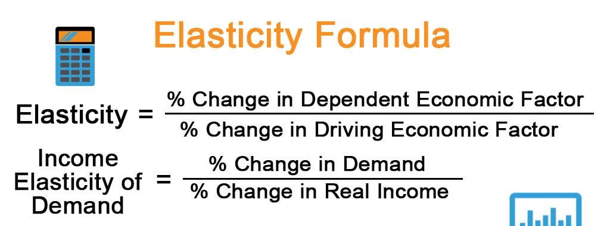

# Misc

### "Which way standard form"
$$X \leq Y \Rightarrow OBJECTIVE + \lambda(Y - X)$$

### "Utility Functions"
* Log
    * Doesn't have any relationship with the interest rate
* CRRA
    * $u(c) = \frac{c^{1-\sigma}}{1-\sigma}$
    * Note: $\lim_{\theta \rightarrow 1} \frac{c^{1-\theta} - 1}{1-\theta} = \ln c$
* CARA?

### "Intertemporal elasticity of substitution"
$\frac{1}{\theta} = IES$. 

* High $\theta \Rightarrow$ really want to smooth consumption. Won't be very reactive to rate changes.
* Low $\theta \Rightarrow$ don't care about smooth consumption. So, very reactive to changes in $r$.

### "Production Functions"
* Cobb-Douglas: $Y_t = K_t^\alpha L_t^{1-\alpha}$
* Linear: $Y = AK_t + BL_t$
    * CRS, but NOT neoclassical (because Marginal products are positive, but not falling!)
    * Production-side equilibrium:
        * $R_t = A; w_t = B$

### "Caution: log-differentiating works only in continuous time!" 
In discrete time you need to use the definition of growth rates...

### "Marginal Utility"
If $MU(c)$ is high then $c$ is low! This makes sense if you plot it out with MU(c) on the y-axis and $c$ on the x-axis and note that MU is falling in $c$.

### "Expectations and Logs"

$$\ln(E[XY]) \neq \ln E[\ln(X) + \ln(Y)]$$

Recall Jensen's inequality:

$$\ln (\operatorname {E} [X])\leq \operatorname{E} \left[\ln (X)\right]$$

### "Induction"
1. Base Case: show that $p(n)$ is true for the smallest possible value of $n, n_0$.
2. Induction Hypothesis: Assume that the statement $p(n)$ is true for any positive integer $n=k$, for $k\geq n_0$.
3. Inductive Step: Show that the statement $p(n)$ is true for $n=k+1$.

### "Standard form for maximization"

Given constraint:
$$LHS \leq RHS$$

Write Lagrangian as
$$\mathcal{L} = OBJ + \lambda[RHS - LHS]$$

### "KKT Algorithm 2 Constraints"
Given want to max
$$\mathcal{L} = f(x, y, z) + \lambda_1(constraint) +  \lambda_2(constraint)$$

**Step 0:**

* Is the function strictly concave? If so, you will automatically have a single interior solution -- assume all nonnegativity constraints are zero and solve normally.... I THINK...

**Step 1:** 

* assume constraint 2 slack ($\lambda_2 = 0$)
* solve
* test if constraint 2 really was satisfied
    * if so, stop here
    * if not, continue

**Step 2:**

* assume constraint 1 slack ($\lambda_1 = 0$)
* solve
* test if constraint 1 really was satisfied
    * if so, stop here
    * if not, continue

**Step 3:**

* Solve with both constraints non-binding (i.e., $\lambda_1=\lambda_2=0$)

> "$-$" in front of objective if minimizing

### "Elasticity"

